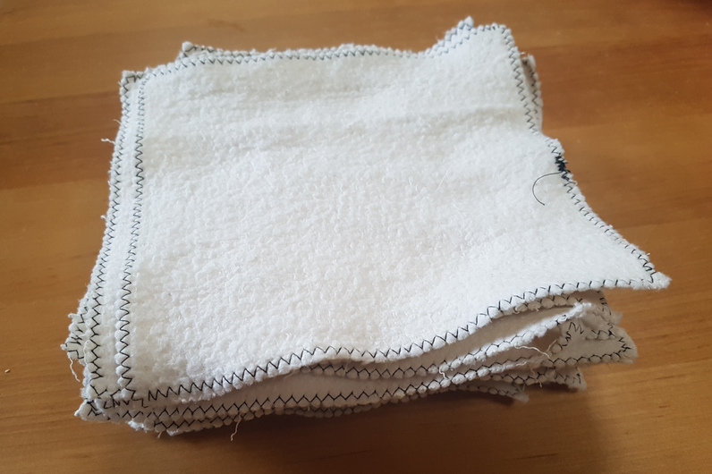
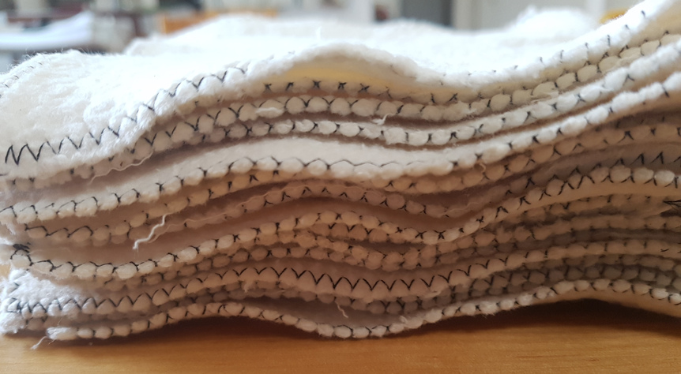

Hochschwanger im Mutterschutz langweilt man sich ja schon ab und zu, wenn man doch nicht mehr ganz so mobil ist und alle Freunde arbeiten sind, während man selbst seine Zeit im wahrsten Sinne des Wortes "absitzt"... Einer meiner guten Freunde in dieser Zeit war Ebay-Kleinanzeigen und da fiel mir dieses nette Molton-Stöffchen ins Auge! Zwar hatte ich keine Ahnung, was ich mit 15m weißem Molton anfangen sollte, aber für 20€ konnte ich ihn nicht liegen lassen und die Ideen kommen bestimmt... Und die Ideen kamen!

Da wir uns für Stoffwindeln für unseren Milchvampir entschieden hatten, mussten auch Stofffeuchttücher (eieiei... drei f) her! Waschen muss man ja sowieso, da machen die paar Stoffstücke auch nichts mehr aus. Die Tücher liegen am Wickeltisch neben einer Wasserschüssel, in welche sie erst kurz vor der Benutzung eingetunkt werden. Ich muss sagen: Ich bin total begeistert! Die Tücher sind angenehm weich, zerreisen nicht und trocknen unheimlich schnell (wobei der letzte Punkt auch egal ist... es sind ja schließlich "Feucht"tücher...). Ein weiterer wichtiger Punkt: seeeehr schnell gemacht und billig. Insbesondere, wenn man es mit den Stofffeuchttüchern bekannter Stoffwindelshops vergleicht, bei denen man etwa 1€ pro Tuch zahlt.

#### Die Herstellung

Verdient das überhaupt einen eigenen Unterpunkt?!?! Ich habe den Stoff in Quadrate geschnitten und mit einem Zick-Zack-Stick umnäht, um Ausfransen zu vermeiden.

Ok... ein bisschen mehr gibt es schon zu sagen...

##### Größe

Ich habe 15x15cm und 20x20cm große Lappen probeweise genäht und mich nach einer angemessenen Probezeit für die kleinere Variante entschieden. Die großen fand ich einfach unhandlich, was dazu geführt hat, dass ich sie bei Benutzung direkt halbiert habe und so in Endeffekt wieder weniger Fläche als bei den kleinen Tüchern hatte. Die großen Tücher werden nun genutzt, um Pipiunfälle bei offener Windel zu verhindern.

##### Welchen Zick-Zack-Stich?

Auch hier habe ich ein paar Versuche gemacht, weil ich nicht wusste, wie sehr der Stoff ausfranzt. Daher habe ich von sehr engen Stichen bis zur "normalen" Standarteinstellung der Maschine vieles getestet. Das Ergebnis: Völlig egal! Daher habe ich bei der Produktion von Nachschub einen eher weiten Stich genommen. Geht schneller.

##### Wie viele Tücher?

Wir haben nun 35 Tücher und das ist völlig ausreichend, da wir ohnehin 2 Mal die Woche waschen müssen. Pro Wickeln verwenden wir 1-4 Tücher. 

#### Ist das nicht eklig?

Wer Kinder hat weiß: Mit den Fäkalien meines Babys komme ich sowieso in Kontakt! Und mehr Kontakt als mit herkömmlichen Feuchttüchern hat man auch nicht. Ich persönlich wische Stoff sogar lieber, da sie deutlich dicker und nicht so schmierig sind. Außerdem finde ich diesen Feuchttücher-sauber-Chemie-"Duft" ziemlich bäh...

Bisher haben wir nur mit Muttermilchstuhl zu tun. Dieser geht rückstandslos bei einer 60°C-Wäsche aus den Tüchern. Sobald es "ernst" wird, gehe ich eventuell dazu über, nur die Pipiwindeln mit Stoff zu wischen und für alles andere Wegwerftücher zu nutzen. Ich werde berichten!
