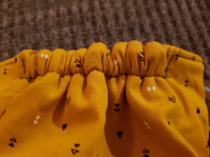
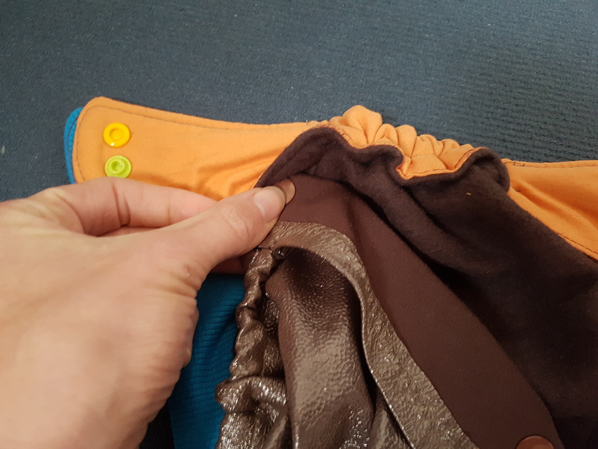

Stoffwindeln selbst nähen?! Wieso das denn? Auf dem Gebrauchtmarkt gibt es Stoffwindeln günstiger und besser verarbeitet. Außerdem lassen die sich anschließend wieder gut verkaufen, weil die Marken bekannt sind. Und woher die Zeit nehmen?

Jaja, so dachte ich 6 Monate lang und dann hat sie mich doch gepackt: Die Lust selbst zu nähen! Vor allem, weil für die Fluff Stuff V2 erstmal kein teurer PUL-Stoff nötig ist und man dadurch viele verschiedene Motive nähen kann, ohne gleich 100€ für 3 verschiedene Stoffe auszugeben, von denen dann auch noch die Hälfte ungenutzt liegen bleibt.

Meine ersten zwei Versionen

Besonders hübsch ist das Bündchen, das nicht nur für einen angenehmen Tragecomfort sorgt und die Windeln vorm Auslaufen schützt, es ist auch ein ziemlich schickes Designelement

Hinten ist ein Gummiband vernäht, damit sich alles an den Minikörper anpasst

Der Außenstoff ist aus Baumwollwebware, der Innenstoff aus Sweat. Ich habe dabei die flauschige Sweatseite nach oben genäht und eine dunkle Farbe gewählt, damit Verschmutzungen nicht sofort sichtbar sind.

Es handelt sich um ein "All-in-3-System" wie bei der Windelmanufaktur und ist auch mit dieser kompaktibel. Die wasserdichte Innenwindel (hier die der Windelmanufaktur) wird also in die Außenwindel geknöpft. Die Knöpfe verschwinden dabei unter den Laschen, was den Tragecomfort erhöht, das Einknöpfen allerdings erschwert. 

Das Saugmaterial (hier eine Bambuseinlage) wird dann in die Innenwindel gelegt

Bei den Laschen gibt es noch die Option diese verkürzt zu nähen, sodass die Windel nicht ganz so dick wird. Das habe ich bei meiner dritten Version getan und werde es auch bei allen weiteren tun, weil die KamSnaps sonst kaum in den hinteren Laschen halten. Die 4 Stofflagen sind einfach zu dick.  Im Bild unten fehlt auch Stilecht der eine Knopf der linken (dicken) Windel. rechts hält alles wunderbar :)

 Alles in allem bin ich aber suuuper zufrieden. Es ist einfach süß!

#### Update

Nach einigem Nutzen komme ich zu dem Schluss, dass die Lasche weg muss! Es ist viel zu fummelig, die Wannen einzuknöpfen. Abdrücke von den Knöpfen habe ich auch ohne Laschen nicht bemerkt. 

Links: Mit vollen Laschen, Mitte: Halbe Laschen, Rechts: Ohne Laschen

Außerdem bin ich dazu übergegangen die Wannen vereinfacht zu nähen. Das geht erstens schneller und zweitens muss man nicht darauf achten, wie rum die Wanne eingeknöpft wird, da es kein vorne und hinten mehr gibt.

Links: Wanne nach Schnittmuster. Es gibt einen durchgängiges Gummiband, die Wanne ist vorn abgerundet. Rechts: Vereinfachste Wanne

#### Galerie

Hier eine Galerie meiner bisher genähten Werke. Eine kleine Sucht hat sich bereits eingestellt :D

#### Kosten

Eine selbstgenähte Stoffwindel hat einen ungefähren Materialwert von etwa **6,50€ pro Stück**. Diese setzen sich wie folgt zusammen:

- **Softies-Stoff für die Wannen**
  
  1m Stoff kostet bei der Stoffwindelei 15,90€. Daraus lassen sich 12 Wannen nähen, was **1,30€** pro Wanne bedeutet. Da diese Stoffart aber im normalen Handel nicht erhältlich ist (zumindest nicht in den Läden, in denen ich geschaut habe), ist es sinnvoll den Versand von 4,90€ zu berücksichtigen, was zu einem Preis von **1,70€** pro Wanne ergibt.

- **Bündchenstoff**
  
  Man benötigt 10 cm Bündchenhöhe. Die Bündchenbreite reicht in der Regel für 2 Windeln, was bei ca 10€/1m Bündchenstoff Kosten von **0,50€** pro Windel ergibt.

- **Knöpfe**
  
  Ich habe ein Paket von 300 Snaps von Prym für 25,80€ gekauft. Das sind etwa 8 Cent pro Knopf. Bei insgesamt 24 verwendeten Knöpfen (inklusive den Knöpfen der Wanne) sind das etwa **1,90€** pro Windel

- **Stoff für Außenwindel**
  
  Außen habe ich immer Baumwollwebware genutzt, innen Sweat-Stoff. Beides ist für durchschnittlich 8€/1m erhältlich. Auf einen Meter kann man jeweils etwa 8 Mal das Schnittmuster auslegen, was einen Betrag von **2€** für Innen- und Außen ergibt.

- **Sonstiges**
  
  Schnittmuster, Gummiband, Maschinenabnutzung, Nähgarn, Fehler machen, etc...

Alles in Allem brauche ich ca. 2-3 Stunden für eine Windel. Wenn man hierbei noch einen fairen Arbeitslohn haben möchte, Steuern zahlen muss, Ausgaben für die Website etc, hat, komme ich zu dem Schluss, dass die Windeln der Windelmanufaktur nicht teuer sondern fair sind. Für wen nähen aber mehr Hobby als Arbeit ist, wird sein Freude an der Fluff Stuff V2 haben. Ist das Baby dann zu groß, kann man die Unikate sicherlich auch gut weiterverkaufen.
