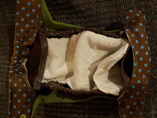

Stoffwindeln selbst nähen?! Wieso das denn? Auf dem Gebrauchtmarkt gibt es Stoffwindeln günstiger und besser verarbeitet. Außerdem lassen die sich anschließend wieder gut verkaufen, weil die Marken bekannt sind. Und woher die Zeit nehmen?

Jaja, so dachte ich 6 Monate lang und dann hat sie mich doch gepackt: Die Lust selbst zu nähen! Vor allem, weil für die Fluff Stuff V2 erstmal kein teurer PUL-Stoff nötig ist und man dadurch viele verschiedene Motive nähen kann, ohne gleich 100€ für 3 verschiedene Stoffe auszugeben, von denen dann auch noch die Hälfte ungenutzt liegen bleibt.

Meine ersten zwei Versionen

Besonders hübsch ist das Bündchen, das nicht nur für einen angenehmen Tragecomfort sorgt und die Windeln vorm Auslaufen schützt, es ist auch ein ziemlich schickes Designelement

Hinten ist ein Gummiband vernäht, damit sich alles an den Minikörper anpasst

Der Außenstoff ist aus Baumwollwebware, der Innenstoff aus Sweat. Ich habe dabei die flauschige Sweatseite nach oben genäht und eine dunkle Farbe gewählt, damit Verschmutzungen nicht sofort sichtbar sind.

Es handelt sich um ein "All-in-3-System" wie bei der Windelmanufaktur und ist auch mit dieser kompaktibel. Die wasserdichte Innenwindel (hier die der Windelmanufaktur) wird also in die Außenwindel geknöpft. Die Knöpfe verschwinden dabei unter den Laschen, was den Tragecomfort erhöht, das Einknöpfen allerdings erschwert. 

Das Saugmaterial (hier eine Bambuseinlage) wird dann in die Innenwindel gelegt

Bei den Laschen gibt es noch die Option diese verkürzt zu nähen, sodass die Windel nicht ganz so dick wird. Das habe ich bei meiner dritten Version getan und werde es auch bei allen weiteren tun, weil die KamSnaps sonst kaum in den hinteren Laschen halten. Die 4 Stofflagen sind einfach zu dick.  Im Bild unten fehlt auch Stilecht der eine Knopf der linken (dicken) Windel. rechts hält alles wunderbar :)

 Alles in allem bin ich aber suuuper zufrieden. Es ist einfach süß!

