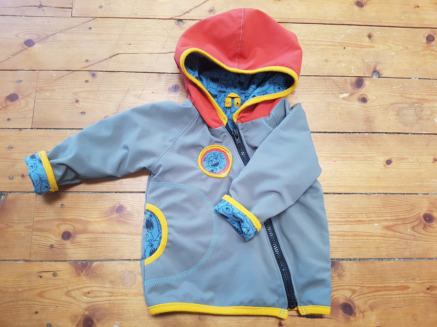
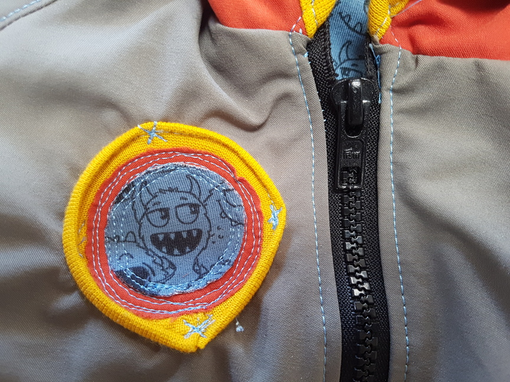

Die Tage werden kälter, das Kind größer und ich habe natürlich mal wieder nicht rechtzeitig eine passende Jacke fürs Kindchen gekauft. Guuut, eine ist hier, aber die gefiel mir nicht so recht. Und Lust zu Nähen hatte ich sowieso mal wieder. Schnittmuster ausgewählt und abgepaust, passender Stoff ausgewählt und dann: Nicht genug Stoff da... dabei tu ich mir eh immer schwer mit der Farbwahl... schweren Herzens habe ich mich dann für eine rote Kapuze entschieden, in der Hoffnung, dass es nicht ganz doof aussieht. Und was soll ich sagen: Für mich die beste Entscheidung seit Langem!

Als Innenstoff ist die Wahl recht schnell auf den neuen Monsterstoff gefallen,

der gleich als Verzierung an der Jackenseite diente

Auch den Mut das kontrastreiche gelb als Bündchen zu nutzen, habe ich nicht bereut! Und dann war ich sogar noch so mutig das erste mal einen richtigen Zierstich in ein Kleidungsstück einzubauen an einer Stelle, die man definitiv sehen wird

Zu schade, dass die Zwerge so schnell aus den Klamotten herauswachsen... aber es kommt ja Nachschub, der sich sicherlich auch über diese Jacke freuen wird! Beziehungsweise freue ich mich, dass ich die Jacke anziehen darf. Den Mops interessiert das eh nicht :D
