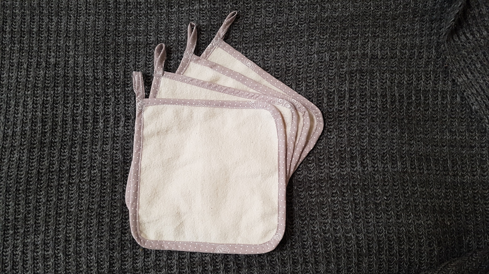
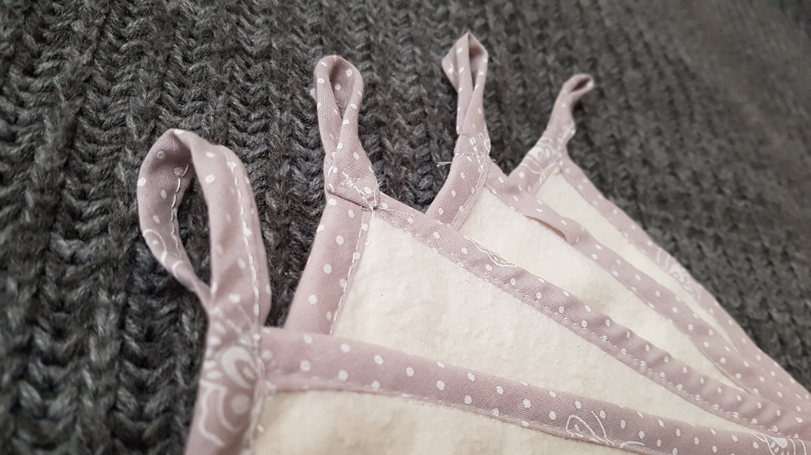
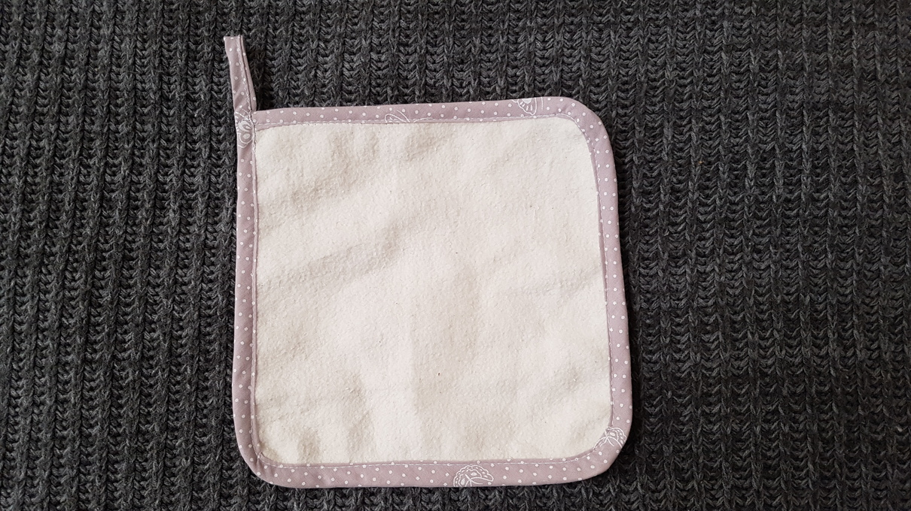

Nach den ganzen Stoffwindeln und Stofffeuchttüchern hatte ich das Verlangen auch Küchenpapier nachhaltiger zu gestalten. Da ich von meinen 15m Moltonstoff noch mehr als genug übrig habe, und sich der Stoff bereits als super Wischtuch für Babys Po heraus gestellt hatte, sollten auch die Wischtücher aus eben diesem Molton sein. Nun hatte ich ja aber schon die Popotücher aus diesem Stoff und die Gefahr, die beiden Tücher zu verwechseln, war mir dann doch zu groß. Und wer will schon  den Tisch mit denselben Tüchern wie Babypopos abwischen?!

Das Einfassband hat den Vorteil, dass man gleich auch noch eine Schlaufe dran nähen kann, um die Tücher problemlos aufzuhängen. Die Größe von 20x20cm finde ich ideal.

Zugegeben... ein bisschen übertrieben ist das ganze schon. Pro Tuch benötige ich etwa 7 Minuten zu Nähen, was bedeutet, dass ich schon weit über eine Stunde an den 10 Tüchern genäht habe. Und 10 Tücher reichen noch lange nicht, um auf normales Küchenpapier zu verzichten, wenn man nicht täglich waschen will. Aber nun habe ich begonnen, jetzt werde ich es vermutlich zu Ende bringen ;)

