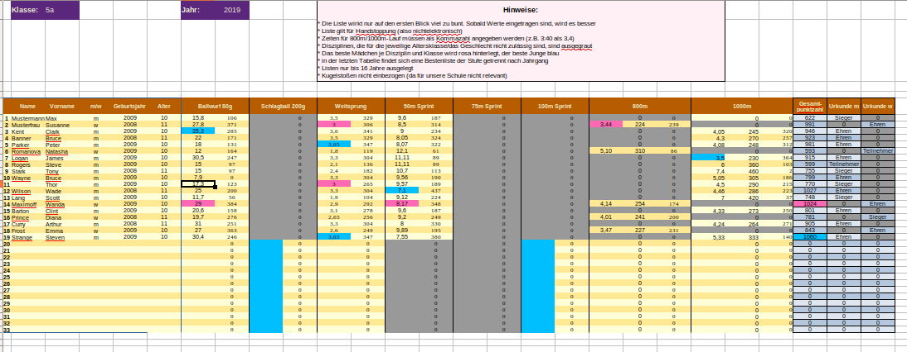
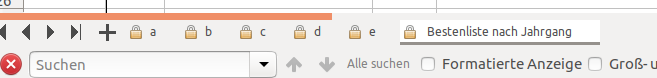
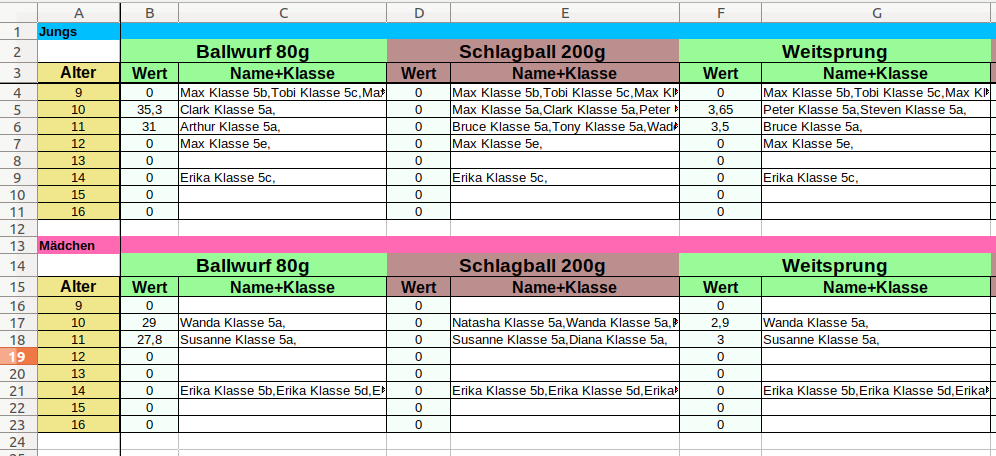
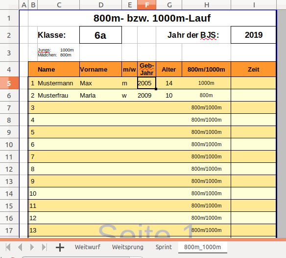

Ich liebe Sportfeste und ich finde es toll, wenn die Besten noch am Wettkampftag gekürt werden können!

Bisher war das bei uns an der Schule immer etwas schwierig, da zwar schon immer Exceltabellen genutzt wurden, allerdings wurde noch vieles händisch erledigt. In einem Jahr haben wir auch die offizielle BJS-App genutzt, waren damit aber aus verschiedenen Gründen nicht ganz zufrieden. 

Also schnell an den PC gesetzt und eine kleine Tabelle geschrieben....

... wäre ja schön, wenn die Tabelle auch... und das hier kann doch auch nicht so schwierig sein... 

Aus "schnell" wurden mehrere Tage und dann noch ein paar Tage Nacharbeit. Aus der "kleinen Tabelle" wurde ein recht umfangreiches Konstrukt, welches viel zu schade ist, um auf meinem PC zu versauern, um nur einmal jährlich an den glohrreichen Bundesjugendspielen unserer Schule zu erstrahlen!  Ganz unten könnt ihr die Liste herunterladen, allerdings ist es vielleicht hilfreich alle Facetten dieses Meisterwerks zu erklären. Es ist wie gesagt doch etwas komplexer geworden.

##### 1. Ausgrauen von Disziplinen

Disziplinen, die aufgrund des Alters oder Geschlechts nicht ausgeführt werden, werden automatisch ausgegraut. Im Bsp. unten sieht man zum Beipiel, dass bei den Mädchen der 1000m-Lauf grau ist, während bei den Jungs der 800m-Lauf grau ist.

##### 2. Teilnehmer-, Sieger- oder Ehrenurkunde?

Die Tabelle ermittelt automatisch, in welchen 3 Sportarten die meisten Punkte erzielt wurden, addiert diese und gibt aus, welche Urkunde der Schüler erhält.

##### 3. Die Besten der Klasse werden markiert

Für jede Disziplin wird der beste Junge der Klasse blau, das beste Mädchen der Klasse rosa markiert. (Jaja Genderstigmatisierung und so... aber das ist ja das Tolle am Klischee: Sie werden auf den ersten Blick verstanden)

##### 4. Die Besten im Jahrgang werden ermittelt

Das Excel-Sheet ist so angelegt, dass alle Klassen einer Stufe in verschiedene Tabellen des gleichen Sheets eingetragen werden. Klasse 5a in Tabelle a, 5b in Tabelle b, usw... . In der letzten Tabelle der Reihe "Bestenliste nach Jahrgang" werden dann die Besten aller 5. Klassen ermittelt.

Die Besten sind wiederum nach Disziplin und Geschlecht aufgeteilt. Da ich im Beispiel lediglich die Tabelle a gefüllt habe, tauchen nur Schüler der Klasse 5a auf. Ganz rechts findet sich natürlich auch der Beste der Gesamtwertung.

Leider habe ich es nicht geschafft, Kinder unterschiedlicher Klassenstufen zu vergleichen, da die Datei zu groß und unbrauchbar wird, wenn ich alle Klassen in ein einziges Sheet zusammenfassen würde. Um die Besten eines Jahrgangs zu ermittelt ist es also unter Umständen nötig, die verschiedenen Klassenstufen durchzusehen. Dieser Aufwand erscheint mir aber tragbar :)

##### 5. (Hoffentlich) idiotensicher

Zellen der Tabelle, die Formeln enthalten, wurden geschützt, damit die Fettfinger nicht versehentlich wichtige Informationen löschen. Außerdem wurde in bestimmten Zellen wie z.B. der Geschlechtsspalte nur bestimmte Eingaben ("m" oder "w") zugelassen. (Ohoh! Schon wieder so schlimm gegendert... Aber an dieser Einteilung ist wohl der Bund Schuld...)

### Riegenkarten

Passend zur Auswertung habe ich noch Riegenkarten erstellt, welche für jede Klasse ausgedruckt und den Riegenführern in die Hand gedrückt werden kann. Das Besondere hierbei: Die Namen und das Alter der Schüler muss nur auf der ersten Tabelle eingetragen werden. Sie werden dann für die anderen Disziplinen kopiert.

Auch hier wird abhängig vom Alter und Geschlecht der Schüler automatisch angegeben, welche Disziplin ausgeführt werden muss.

### Achtung

Bisher habe ich die Tabelle erst einnmal getestet und habe dabei hoffentlich alle Fehler ausgebügelt. Ich garantiere aber für nichts! Lieber nochmal kontrollieren ;)

Außerdem ist die Tabelle auf die Absprache unserer Schule ausgelegt. Demnach sind folgende Dinge einprogrammiert:

- Kein Kugelstoßen enthalten (da wir BJS nur bis zur 7. Klasse machen)

- Alle 13 jährigen (m und w) machen 75m-Lauf (eigentlich dürfte hier zwischen 75m und 100m gewählt werden)

- 12-jährige Jungs und 14-jährige Mädchen werfen mit 200g (ebenfalls keine Wahl)

### Download

Letzte Aktualisierung 2019

[Riegenkarten](Dateien/Riegenkarten.xlsx)

[Auswertungslisten](Dateien/2019_Wertungslisten_Muster.xlsx)
