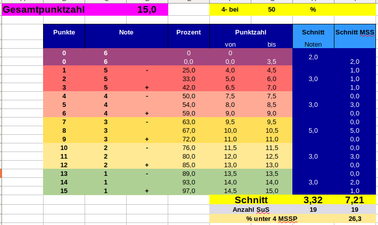
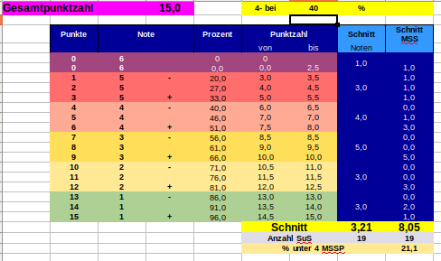
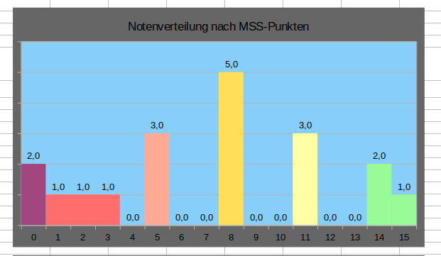

Diese Exceltabelle soll helfen bei Klassenarbeiten die Noten anhand der erreichten Punktzahl festzulegen. 

Die Tabelle ist in drei Teile aufgeteilt: Im rechten Teil (1) werden die Schülernamen mit erreichten Punktzahlen eingegeben und die jeweilige Note ausgegeben, links daneben (2) ist der Notenspiegel zu sehen wo auch die Notenverteilung nach Noten angezeigt und angepasst werden können, unten darunter (3) ist ein Diagramm des Notenspiegels zu sehen.

## (1) Namen und Punktzahlen eintragen

Oben in der blauen Leiste werden die maximal erreichbaren Punkte pro Aufgabe eingegeben werden. "A1a" bedeutet bei mir, "Aufgabe 1, Teilaufgabe a". Im Beispiel gibt Aufgabe 1 also insgesamt 7 Punkte (4 Punkte für Teilaufgabe a, 3 für b). Aus dieser Leiste wird die Maximalpunktzahl von 15 Punkten errechnet, welche zur Bestimmung der Noten in Tabellenteil (2) genutzt wird.

Max Mustermann hat beispielsweise 3, 3, 3, 2 Punkte bekommen, erreicht damit eine Gesamtpunktzahl von 12 Punkten, was der Oberstufennote (bei uns "MSS-Punkte" genannt) von 11 Punkten bzw. der Schulnote 2 entspricht. Bei Clark Kent sieht man, dass  die Notentendenzen - und + durch eine Extraspalte eingebunden sind. 

Unter der Spalte "Extra" können eventuell vergebene Sonderpunkte eingetragen werden.

Unterhalb der Tabelle habe ich etwas Statistik eingebunden. Es wird angezeit, wieviel Prozent der Maximalpunktzahl im Schnitt von den Schülern erreicht wurde. Dies sorgt für einen schnellen Überblick, ob einzelne Aufgaben für viele Schüler zu schwierig war. 

Ganz rechts ist der Notendurchschnitt zu sehen. 

## (2) Notenspiegel

Ganz oben ist die Gesamtpunktzahl (im Bsp. 15 Punkte) zu sehen, welche sich aus der Summe der Punkte pro Aufgabe ergibt. In der gelb unterlegten Zelle kann eingegeben werden, bei wieviel Prozent der Gesamtpunktzahl gerade noch die Note 4- erteilt werden soll. In diesen Fall bei 50%, also 7,5 Punkten. Ändert man diesen Wert, passt sich die Tabelle automatisch an (Bsp. unten bei 40%). 

Dunkelblau unterlegt ist der Notenspiegel im 6er-System und im Oberstufen-Punktesystem. Im Beispiel haben also 2 Schüler die Note 6, 3 die Note 5, 3 die Note 4, etc..., was einen Notendurchschnitt von 3,32 ergibt. Bei uns darf die Anzahl der Schüler, die schlechter als 4- sind, einen bestimmten Prozentsatz nicht überschreiten, sonst muss die Arbeit vom Schulleiter genehmigt werden. daher wird dieser Prozentsatz ebenfalls ausgerechnet.

Leider ist es nicht möglich diese Tabelle andersrum zu sortieren, sodass Note 1 ganz oben ist und Note 6 unten. Dann funktioniert die Zuordnung für Tabellenteil (1) nicht mehr richtig.

## (3) Graphische Darstellung

Ich denke dieser Teil ist selbsterklärend. Physiker mögen Graphen.... Leider funktioniert der Graph im 6er-System nicht richtig, da das Programm mit den zusammengefassten Zeilen nicht klar kommt. Wenn ich Zeit habe, kümmere ich mich mal darum.

Auch hier wie immer: Wenn dir Fehler auffallen, oder du Anregungen/Ideen hast, kannst du mir gerne schreiben.

### Download

[Excel__Punkteverteilungsliste](Dateien/Punktetabelle_Oberstufe_Template.xlsx)
