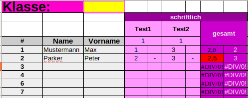
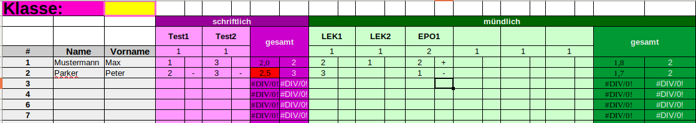
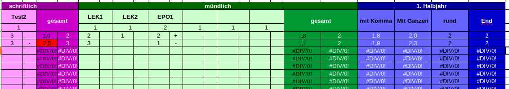
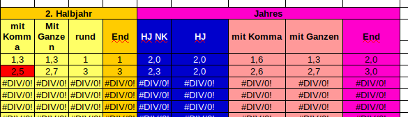
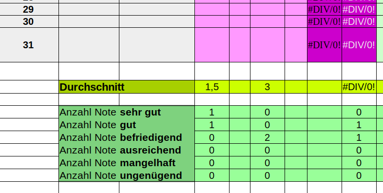
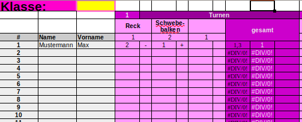

"Auf welcher Note stehe ich momentan?"... wie ich diese Frage "liebe"... aber ein Stück weit Auskunftspflichtig ist man ja doch.... mir persönlich hilft dabei eine Exceltabelle, die stets aktuell anzeigt, auf welcher Note der Schüler steht und welche Note er rein hypothetisch im nächsten Test bekommen müsste, um die nächst bessere Stufe zu erreichen. 

Hier meine Variante der Tabelle:

Na? Nichts zu erkennen? Also der Reihe nach...

##### Eintragen der Noten

Die Tabellen sind stets so angeordnet, dass in die linke Zelle die Note (1-6) und ich die rechte Zelle die Tendenz (+ oder -) eingetragen wird. Das habe ich so gemacht, weil hier in Rheinland-Pfalz die Tendenzen bei der Berechnung der Endnote zunächst nicht berücksichtigt werden darf und nur im Falle einer nicht eindeutigen Note (etwa zwischen x,4 und x,6) herangezogen werden. Bei Peter etwa würde ich mich nun für die Note 3 entscheiden, da er auf 2,5 steht und zwei mal eine negative Tendenz in den Einzelnoten hat.

Falls das in deinem Bundesland anders ist, kannst du die rechte Zelle jeweils löschen und stattdessen die Notentendenzen wie z.B. 1- als 1,3 eintragen.

##### Noten gewichten

Zunächst einmal wird in Hauptfächern und in der Oberstufe nach "schriftlichen" und "mündlichen" unterschieden, wobei die "mündlichen Noten" durchaus schriftlich erfolgen können... verwirrende Angelegenheit.... kurz gesagt: "schriftliche Noten" sind ausschließlich fest vorgeschriebene, umfangreichere, schriftliche Tests, die bei uns"Klassen-" oder "Kursarbeiten" heißen. Alle anderen Noten gelten als "mündlich"- Dabei können die erbrachten Leistungen sehr unterschiedlich sein und sollten daher auch unterschiedlich stark in die Gesamtwertung einfließen.  Eine Epochalnote zum Beispiel kann doppelt so stark ins Gewicht fallen, wie eine Lernerfolgskontrolle (LEK. Auch bekannt als Hausaufgabenüberprüfung o.ä.). Das kann durch den Faktor "2" unter der Notenbeschreibung angegeben werden.

Für den schriftlichen und mündlichen Bereich wird jeweils eine gewichtete Durchschnittsnote ermittelt. Beispielrechnung für Max Mustermann:

###### schriftlich:

(1+3)/2=2 --> gerundet Note 2

###### mündlich:

(2+1+2x2)/4=1,8 --> gerundet Note 2

##### Unterschiedlich viele Noten

Peter hat die LEK2 nicht mitgeschrieben. Kein Problem, damit kommt die Tabelle klar! Einfach die Zelle freilassen, dann wird die Gesamtnote trotzdem richtig berechnet.

##### Berechnung der Endnote

Aus schriftlicher und mündlicher Note wird die Gesamtnote ermittelt. Das tue ich auf 2 verschiedene Arten:

1. Die Kommzahlen der ermittelten schriftlichen und mündlichen Noten werden mit ein Drittel zu zwei Drittel verrechnet. Bsp. 
   
   Bsp. Peter: 2,5x1/3  +  1,7x2/3  =  1,9

2. Die gegeben ganzen Noten der ermittelten schriftlichen und mündlichen Noten werden mit ein Drittel zu zwei Drittel verrechnet
   
   Bsp. Peter: 3x1/3  +  2x2/3  =   2,3

Standartmäßig wird das Ergebnis der 2. Variante als Zeugnisnote ("End") übernommen (Vorgabe RLP). "End" entspricht der Zelle "rund". Allerdings muss die Zeugnisnote ja nicht unbedingt der gerundeten Zahl entsprechen, vor allem dann nicht, wenn der Schüler zwischen zwei Noten steht. In diesem Fall ändere ich die Note "End" händisch und lasse die Note in "rund" unangetastet.

Übrigens werden Noten zwischen x,4 und x,6 rot unterlegt, um daran zu erinnern, das hier pädagogisch bzw. anhand der Tendenzen entschieden werden sollte (zu sehen bei Peters schriftlicher Gesamtnote).

##### Ganzjahresnote

Die Ganzjahresnote ergibt sich wiederum aus einem Drittel des ersten Halbjahres und zwei Dritteln des zweiten Halbjahres, wobei hier mit der errechneten Note der Halbjahre und nicht der tatsächlich gegebenen Note gerechnet wird. In diesem Fall wird für Peter also mit der 2,3 aus dem ersten Halbjahr und der 2,7 aus dem zweiten Halbjahr gerechnet. So ergibt sich eine 2,6, was im Zeugnis entweder eine 2 oder 3 bedeutet. Standartmäßig wird wieder auf 3 gerundet.

##### Durchschnitte

Unterhalb der Notenlisten habe ich jeweils die Notenspiegel zu den einzelnen Tests eingefügt. Ich denke, das ist selbsterklärend.

### Weitere Versionen

##### Nebenfächer

Die vorgestellte Tabelle nutze ich nur für die Oberstufe, da ich keine Hauptfächer unterrichte. In der Mittelstufe gibt es in den Nebenfächern aber keine schriftlichen Noten, was die Tabelle vereinfacht.

##### Sport

Für Sport habe ich verschiedene Blöcke für die jeweiligen Sportarten gemacht. Pro Sportart wird dann eine Note ermittelt, die im Zeugnis zur Gesamtnote verrechnet werden.

Ein Block kann zum Beispiel die Sportart Turnen enthalten, wobei Noten am Reck und am Schwebebalken gemacht wurden. Die Schwebebalkenkür war aufwendiger, weswegen diese Note doppelt gewichtet wurde. 

Die einzelnen Sportarten können ebenfalls gegnüber anderen Sportarten des Halbjahres gewichtet werden durch die Zelle links neben der Sportart (hier Einfachgewichtung "1" von Turnen).

#### Download

[Zeugnisnotenberechnung_Oberstufe_Template](Dateien/Zeugnisnotenberechnung_Oberstufe_Template.xlsx)

[Zeugnisnotenberechnung_Nebenfach_Template](Dateien/Zeugnisnotenberechnung_Nebenfach_Template.xlsx)

[Zeugnisnotenberechnung_Sport_Template](Dateien/Zeugnisnotenberechnung_Sport_Template.xlsx)

