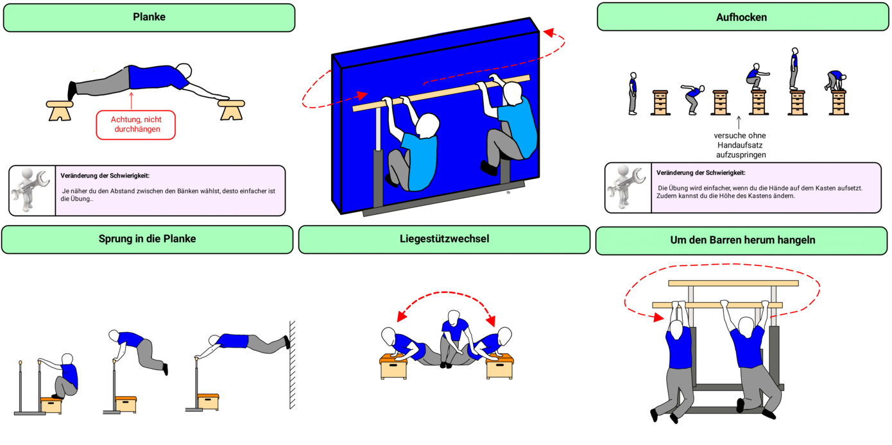
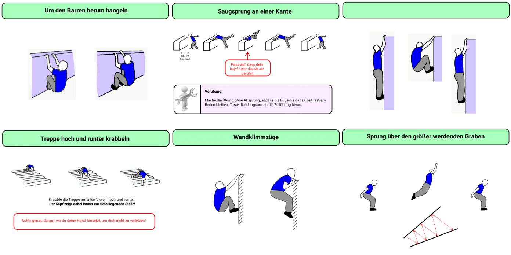
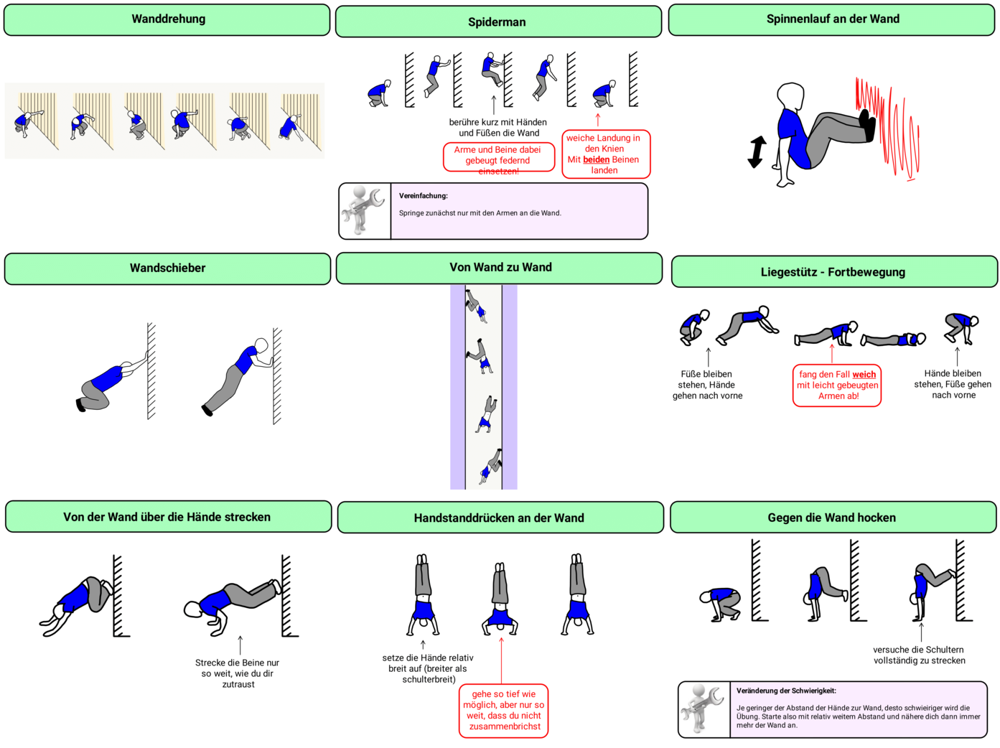

Im unteren Bereich können alle hier gezeigten Bildkarten als PDF heruntergeladen werden

---

Seit einigen Jahren unterrichte ich Parkour als Wahlangebot an unserer Schule. Da meiner Meinung nach **Kraft** die wichtigste Vorraussetzung ist, um im Sport (und insbesondere im Turnen und Parkour) weiter zu kommen, binde ich in allen meinen Sportstunden ein intensives Krafttraining ein. Damit es nicht immer nur bei Liegestützen, Sit-ups, etc. bleibt, schaue ich mich gerne nach interessanteren/anspruchsvolleren Varianten um. In diesem und weiteren Post stelle ich euch ein paar Übungen davon vor und hoffe, dass ihr oder eure Schüler davon profitieren können.

#### Übungen für die Halle

Die Übungen für die Halle können in der Regel auch draußen durchgeführt werden, wenn ein passender Ort dafür gefunden wird. Prinzipiell ist bei den Geräten der Vorteil, dass die Schüler die Gerätehöhen ihrem Leistungsstand anpassen können.

Die erste Übung (Planke) lässt sich übrigend hervorragend am Treppengeländer durchführen, welches die Traceuere dann nach oben oder nach unten "laufen" können (also Stück für Stück weiter krabbeln. Hilfestellung ist empfehlenswert, da ein Sturz auf die Treppen nicht unbedingt ungefährlich ist).

#### Übungen für draußen

Hier gilt das Prinzip genau andersrum: wenn man die passenden Geräte in der Halle hat, kann man die Übungen natürlich auch drinnen durchführen. Den "Saugsprung an einer Kante" z.B. lässt sich gut an einem Kasten durchführen. Leider stimmen die Überschriften nicht so ganz. Ich werde das evtl im PDF unten bald ändern. Die Vorschaubilder hier werde ich wohl aus purer BEquemlichkeit nicht anpassen.

#### Übungen egal wo

Für die folgenden Übungen ist eigentlich nur eine Wand und Boden notwendig, daher kann man sie fast überall durchführen

 

#### Download

[PDF Parkourkrafttraining](Dateien/ParkourKraftübungen.pdf)

Die PDF wurde mit der App "MetaMoJi Note" erstellt und kann damit auch bearbeitet werden. Wenn du die Rohdatei (.atdoc-Format) haben möchtest, dann schreibe mir eine Mail.
