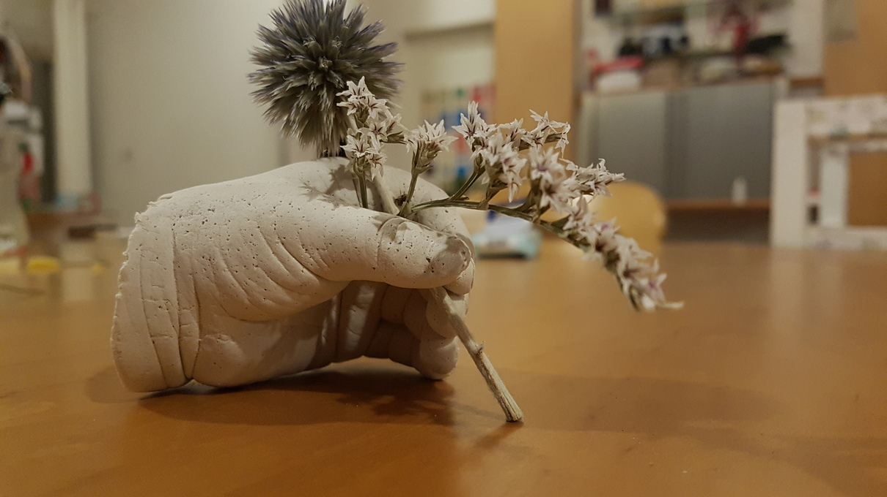
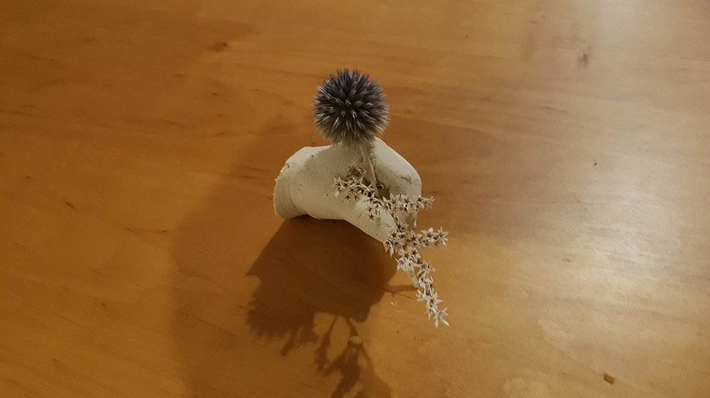
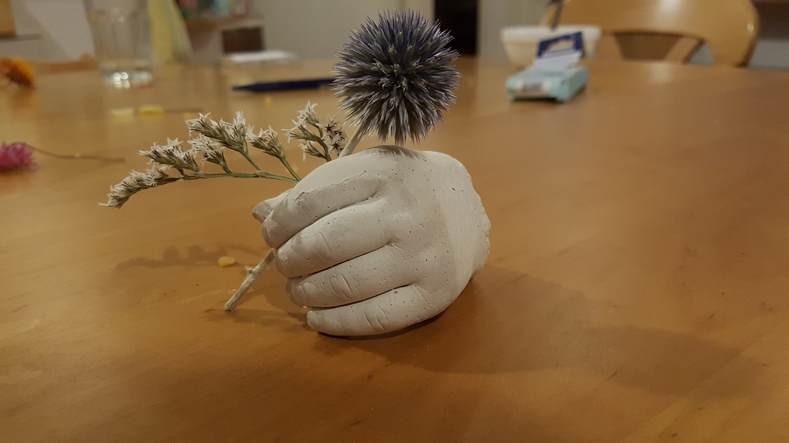
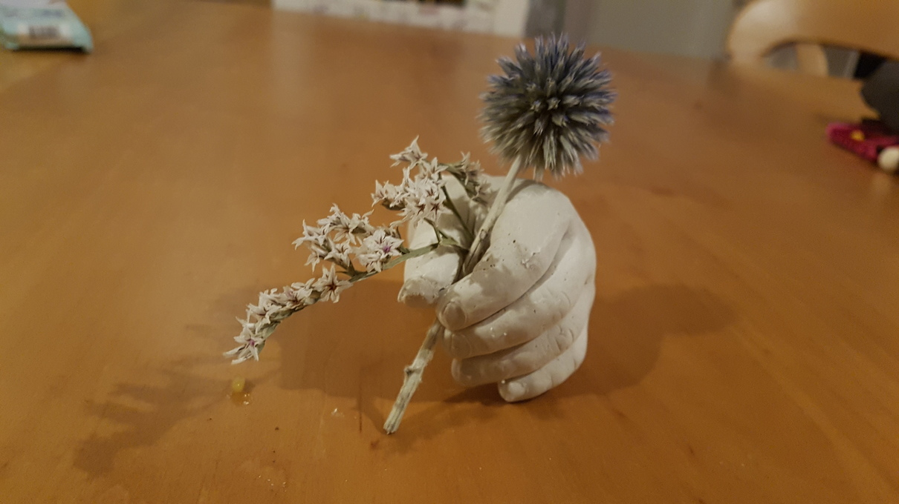

Ein kleines Geburtstagsgeschenk für die Schwiegermutter, das sich als echtes Teamwork der Familie herausstellt.

Damit Baby im Alginat halbwegs stillhält, muss Papa ihn ablenken, während Mama darauf achtet, dass sich die Hand tatsächlich im Topf befindet. Und dann heißt es warten..... Hat Baby die Hand ruhig gehalten? Wie hat er die Finger überhaupt gehalten? Hängt er irgendwo am Topfrand? AAAAHHH!!! Wie lange braucht denn dieser blöde Gips, um hart zu werden?! Ich will das Ergebnis sehen!

Und dann endlich ist es soweit! Meine Erwartungen des eigentlichen Probestücks werden bei Weitem übertroffen und das Probestück wird zum Endprodukt.

Guuut... ürde ich es nochmal machen, würde ich den Armsatz etwas länger lassen. dann sähe es nicht ganz so nach abgehackter Hand aus.

Ich finde es immer aber wieder faszinierend, wie detailreich diese Alginatabdrücke sind. 

Die Trockenblume dient übrigens gleichzeitig als Stütze für das ganze Konstrukt.

Ich finde es ein gelungenes Steh-im-Weg und die Beschenkte hat sich gefreut :)

Übrigens eignet sich ein solcher Alginatabdruck auch besonders gut, um an einer Hochzeit einen Abdruck der verschlungenen Hände der frisch Vermählten zu machen. Das Hochzeitspaar muss nur wenige Minuten ausgeliehen werden und erhalten bereits am Ende der Feier ihr in Gips gegossenen Abdruck, der an die Feier erinnert. Nicht vergessen die Ringhand dafür zu nehmen!

Leider habe ich nicht daran gedacht ein Foto davon zu machen, und nun ists ja beim Brautpaar.

