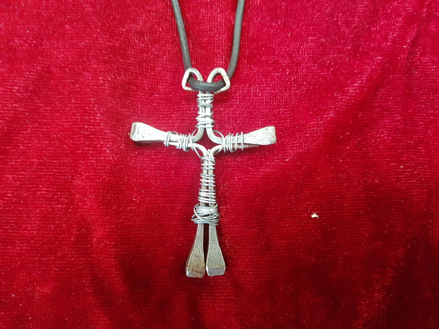
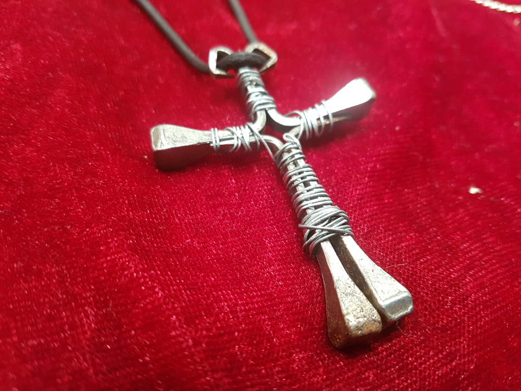
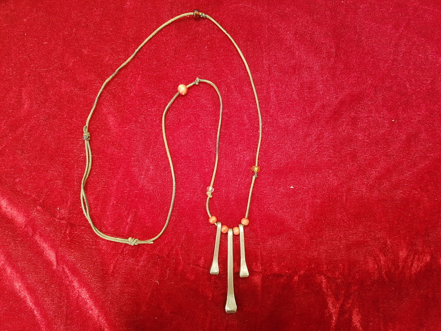

Ich habe nun den Schritt gewagt, das riesige Lager des schon lange geschlossenen Kaufhauses meiner Familie zu räumen. Vieles wurde verkauft oder verschenkt aber in jeder Ecke taucht noch irgendein Zeug auf, von dem man teilweise nicht mal mehr weiß, was das ist. So fand ich ganz oben im Stahlträger des Daches braune Pappschachteln die nach vorletztem Jahrhundert aussahen. Darin: Hufnägel! Massenhaft! Ein Gespräch mit einem Hufschmied verriet mir, dass diese nicht am Pferd benutzt werden dürfen, da sich doch der ein oder andere Rost angelegt hat. "Wir haben als Kinder Schmuck daraus gemacht", erzählte meine Mutter... da war ich  getriggert! Schnell mal Pinterest geöffnet und "Hufnagel" eingegeben. Und habe ein etwas nach steampunk wirkendes Kreuz gefunden.

Mein erster Versuch das nachzumachen:

Für den ersten Versuch finde ich es schon ganz passabel. Für eine Freizeit mit (christlichen) Jugendlichen ist das bestimmt eine tolle Nachmittagsbeschäftigung.

Dass die Nägel etwas rostig sind, finde ich keinesfalls negativ. Bei dem Draht handelt es sich um Blumendraht, den ich ebenfalls in Massen im Lager gefunden habe.

Anschließend habe ich ganz verschiedene Dinge ausprobiert. 

 

