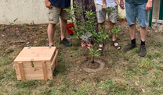

Für den ersten Geburtstag unseres Zwergs habe ich im WWW eine ganz tolle Idee gefunden, die ich unbedingt umsetzen wollte. Eine Kiste gefüllt mit Dingen, die im ersten Lebensjahr des Babys in irgendeiner Art relevant waren, sei es für das Kind selbst (erste Schuhe) oder für die Gesellschaft (Corona lässt grüßen). Die Gäste können ihren Beitrag an der Geburtstagsfeier leisten und etwas in die Kiste legen, die dann für die nächsten 17 Jahre verschlossen wird.

Am 18. Geburtstag wird sie dann dem jungen Erwachsenen überreicht.

Ich liebe diese Idee und hoffe, dass meine Kinder sich ebenso freuen Geschenke von den Lieben zu erhalten, die sie vor 17 Jahren ausgewählt haben oder eine Nachricht vom längst verstorbenen Opa zu erhalten.

Eigentlich wollte ich eine Kiste dafür kaufen, weil man ja nicht alles selbst machen muss. Nur leider waren schöne Kisten unheimlich teuer und alles bezahlbare war so zerbrechlich, dass ich nicht sicher bin, ob es den ersten Neugierattacken der Kleinen standhalten würde. Also habe ich selbst Hand angelegt. Das ist das Ergebnis:

Tatsächlich war die Kiste schneller gebaut als gedacht. Schnell ein paar passende Latten gekauft und zusammen geschraubt

Der Griff zum Heben der Kiste besteht ebenfalls aus einer einfachen Latte. Auf diesem Bild kann man auch sehen, dass es sich lohnt die etwas teureren GANZ gerade Latten zu kaufen, sonst wird die Kiste eben nicht GANZ grade (siehe Ecke unten links)

Und natürlich hab ich Fehler gemacht... wie immer gaaaaaanz am Ende, wenn man eigentlich denkt, dass man fertig ist und "nur noch schnell das Scharnier" festmachen muss.... und zwar so von innen, dass sich die Kiste nicht mehr öffnen lässt...... naja, nun sind die Scharniere von außen befestigt. Durch die Messingfarbe finde ich es auch nicht schlimm und passt zum Schloss.

Noch eine Kette eingebaut, damit der Deckel nicht nach hinten fällt und dabei das Scharnier zu stark belastet

Fertig! Stabil genug, um es zwischenzeitlich als Kletterkiste zu nutzen ist sie auch. An der Feier wurde noch mit den Patenonkeln ein Apfelbäumchen geplanzt und die Kiste gut gefüllt! Natürlich kann ich nicht verraten mit was... wer weiß, wie lang dieser Blog online bleibt und meine Kinder davon erfahren ;)

