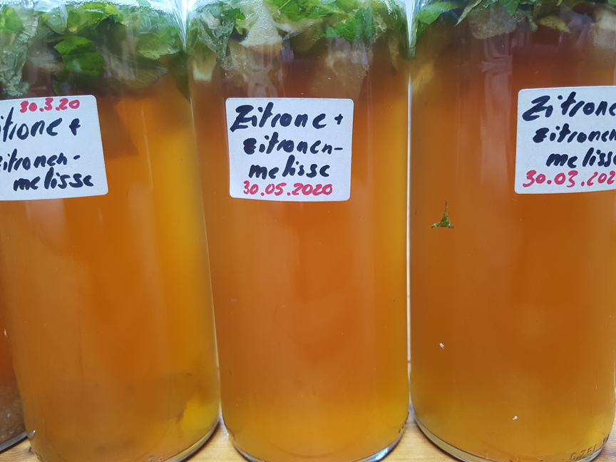
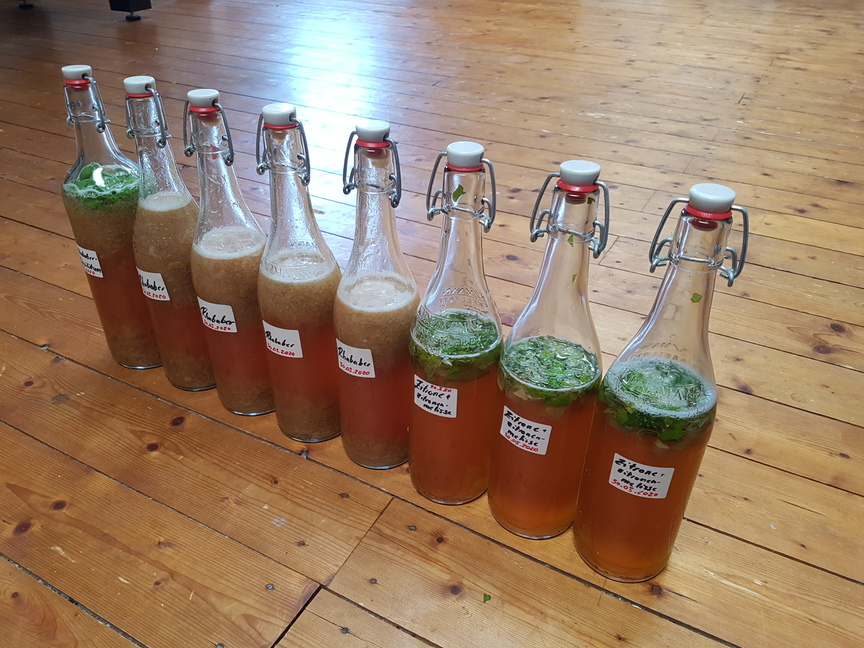
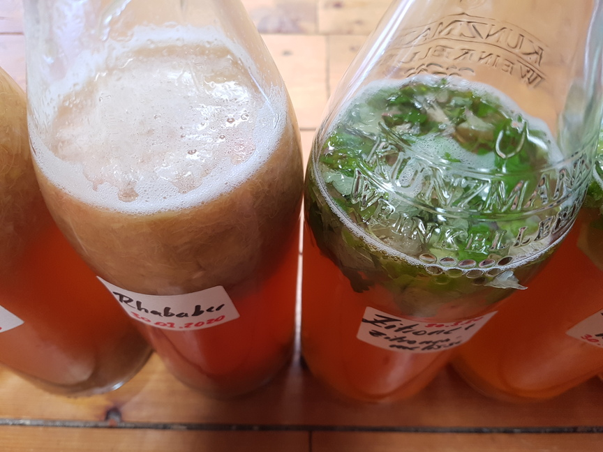

Ein Freund erzählte mir kürzlich von seinem neuen Hobby Kombucha herzustellen und brachte mir gleich ein Fläschchen davon mit. Der etwas bittere Geschmack traf sogleich auf Gegenliebe und erweckte den Wunsch ebenfalls tätig zu werden. Alles, was dazu nötig ist, stand hier ohnehin rum (wie so vieles....).

- Tee in Hülle und Fülle

- Ein dickes Glasgefäß mit Ausguss aus dem Whiskyladen meines Vaters

- Glasflaschen zum Abfüllen der Köstlichkeiten mit Plopp-Verschluss

- und natürlich Zeit :)

Gleich mit der ersten Fuhre habe ich die verschiedensten Kräuter und Früchte in die Flaschen getan, die mal mehr und mal weniger gut gemundet haben

Doch muss ich sagen, dass mir nach vielem Hin und Her tatsächlich die pure Variante ohne fancy Zweitfermentation am besten gefällt... vorausgesetzt, man füllt rechtzeitig ab, sonst hat man viele Flaschen voll Essig...

