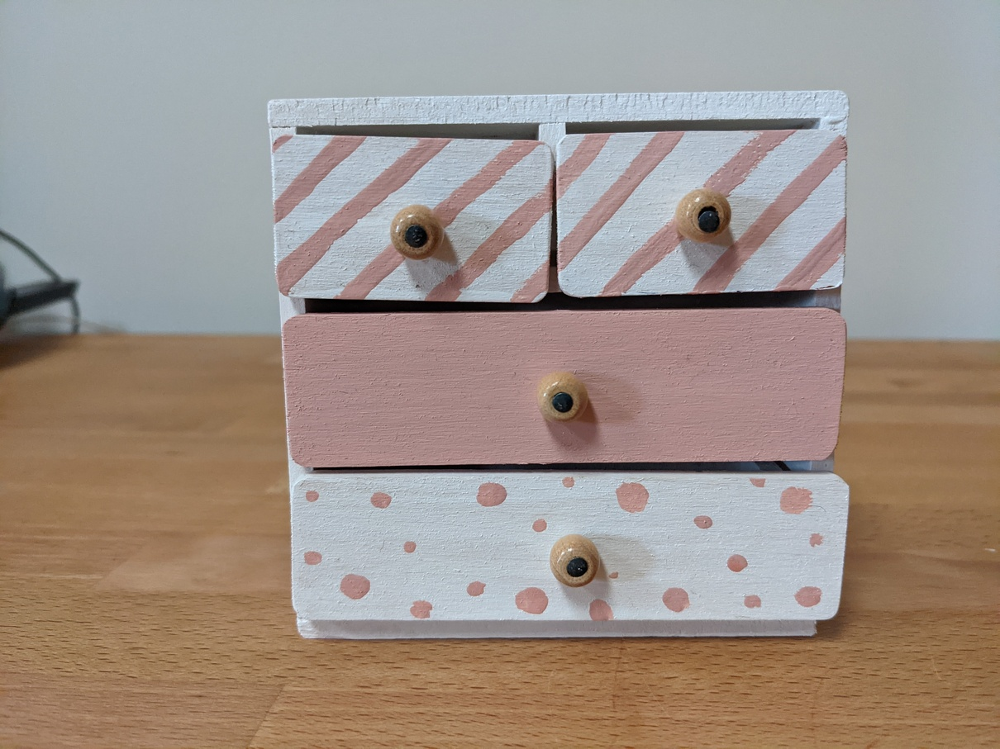
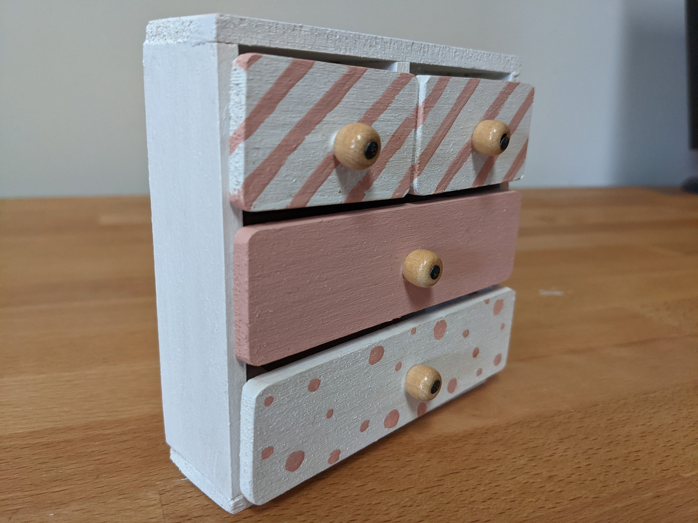
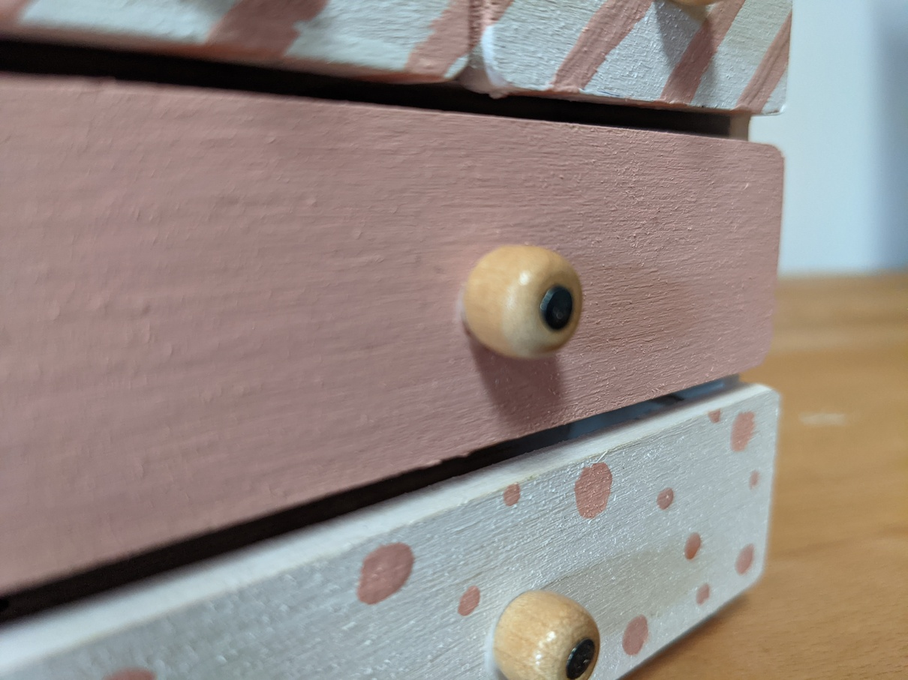
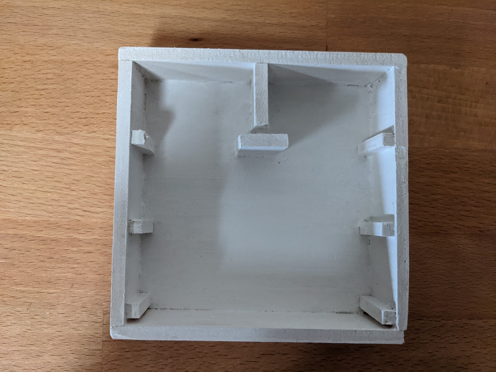
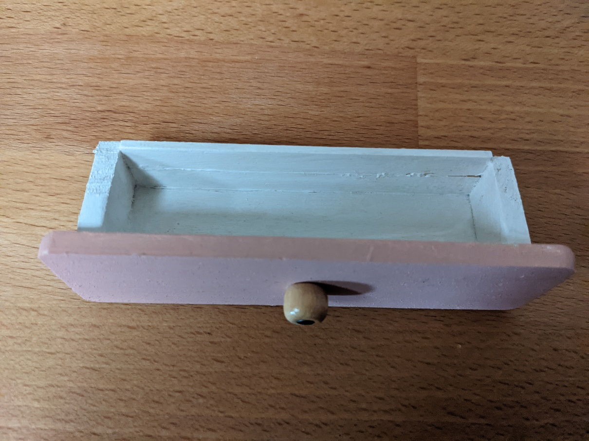

Meine Nichte bekam zu Weihnachten ein Puppenhaus und ich kündigte hochmotiviert an, ein paar Möbel dafür zu bauen... Aus den "Möbeln" wurde genau ein Schrank

Der war dann doch Arbeit genug... Perfekt ist er auch nicht geworden, aber für meinen ersten Minimöbelbau doch ganz passabel

Die Schubladengriffe sind aus Holzperlen gemacht, die mit Holzleim und einem Nagel hoffentlich für die Ewigkeit befestigt wurden.

Wie man auf den ersten Bildern erkennen kann, liegen die Schubladen teilweise etwas schief, was an der Bauart des Schrankkorpusses liegt. ich habe lediglich kleine Schienen eingeklebt, welche leider für die 2 kleinen Schubladen ganz oben nicht ganz auf der gleichen Höhe sind. 

Auf die Schubladen an sich bin ich stolz auch wenn sie bei Weitem nicht perfekt sind. Für die unpräzisen Werkzeuge, die ich genutzt habe, ist das Endergebnis überraschend rechtwinklig

Für die Farbwahl ist die Farbaufteilung des gesamten Puppenhauses verantwortlich. Das Schlafzimmer ist nunmal rosa. Da die einzigen mir zur Verfügung stehenden Farben rot, blau und weiß sind, musste gemischt werden. Ob der Farbton nun tatsächlich zum fertigen Haus passt, habe ich gar nicht mehr überprüft

