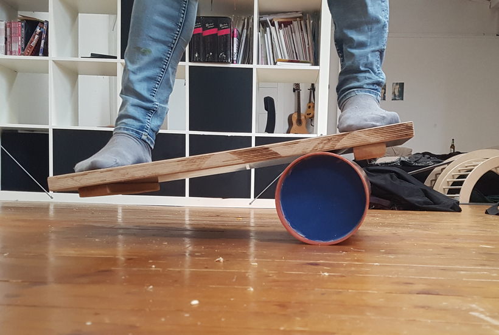
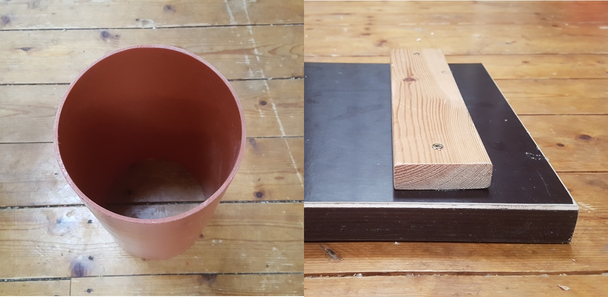
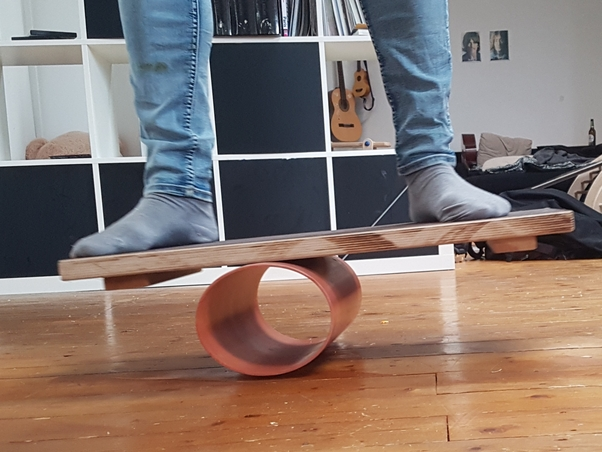
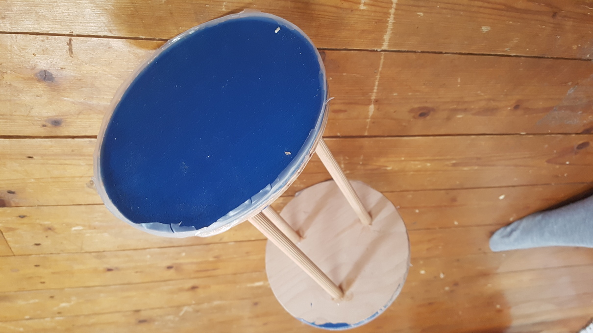
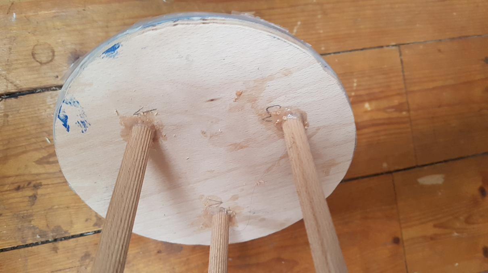
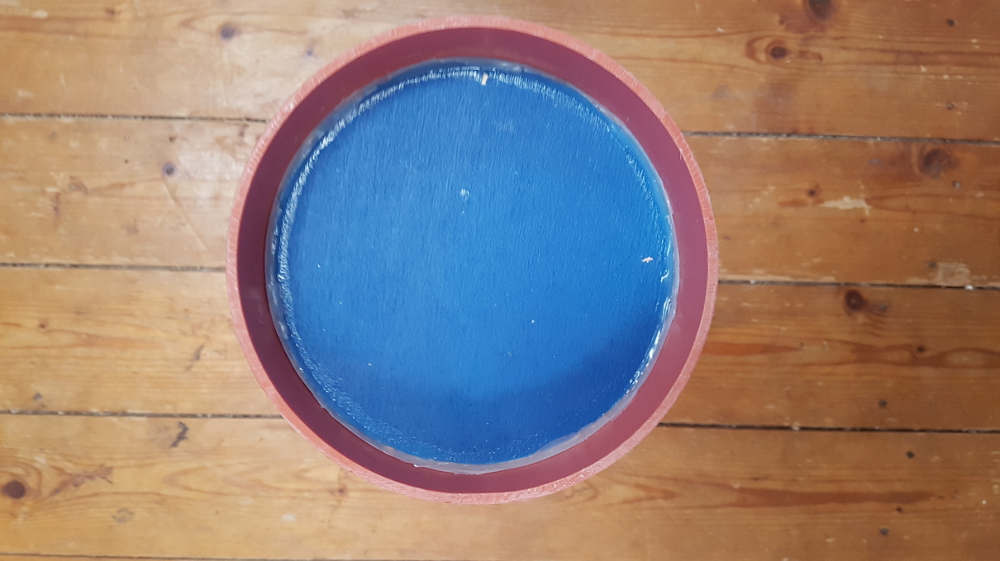
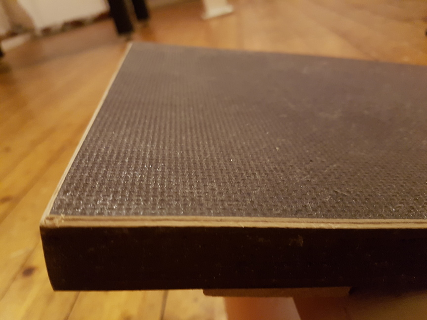
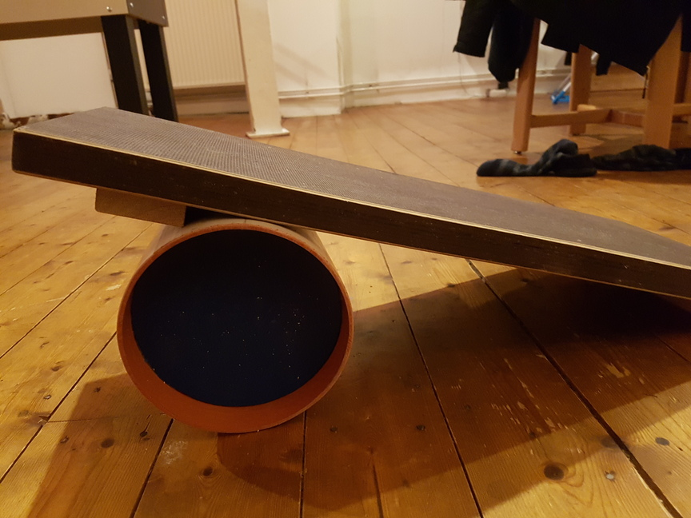

Der Wille ein Rola Bola zu bauen kam weniger aus dem Wunsch ein solches Gerät zu haben (obwohl ich solche Dinge prinzipiell liebe) als aus der Tatsache, dass ich Rohre und Bretter im Übermaß habe und mich fragte, was ich daraus machen könnte. 

Also: Abflussrohr zurechtschneiden, Brett drauf, Stopper ans Brettende: Fertig!

Leider nicht ganz... neben dem ganzen Schleifen zeigte sich am Ende ein ganz anderes Problem! Das Rohr ist nicht stabil genug und biegt sich durch das Gewicht von Brett und Person zu einem Platten Ei. Das macht das Balancieren viel zu leicht und besonders lang halten wird es so auch nicht. 

Also habe ich kurzer Hand zwei Runde Holzscheiben gesägt, welche genau in das Rohr hinein passen, habe diese mit 3 Stangen verbunden und schließlich ins Rohr geklebt. Der Kleber hält zwar nicht so wirklich, aber solang keine gierigen Kinderhände daran herumfummeln, sollte es halten.

Als Brett habe ich übrigens eine Siebdruckplatte genutzt, die auch für den Bühnenbau verwendet werden. Davon haben wir unzählige Reststücke herumliegen. Vorteil davon ist die angeraute Oberfläche, die einen sicheren Stand bietet. Durch meine neu erlernten Fähigkeiten im Umgang mit der Oberfräse, konnte ich auch professionelle Kanten herstellen.

Nun war es also wirklich fertig und nutzbar! Bisher wird es allerdings wenig genutzt...

