"Nur die Sturmklinge, [...] kann den gefährlichen Schwarzmagier Nemetor stoppen, der die Westreiche bedroht", so die Rahmenstory des Fantasy-Krimidinners, zu welchem wir mit 8 Freunde einluden. Da ist klar! Die Sturmklinge muss unbedingt als Requisit auftauchen! Nach ein paar Youtube-Videos habe ich mich für die Pappmaché-Variante entschieden

 Das Grundgerüst stellen einfache Rollen aus Kopierpapier da (ich habe immer eine Menge beschriebenes Schmierpapier hier rum liegen), welche dann ein die Pappform geschoben werden (hier aus gelber Pappe)

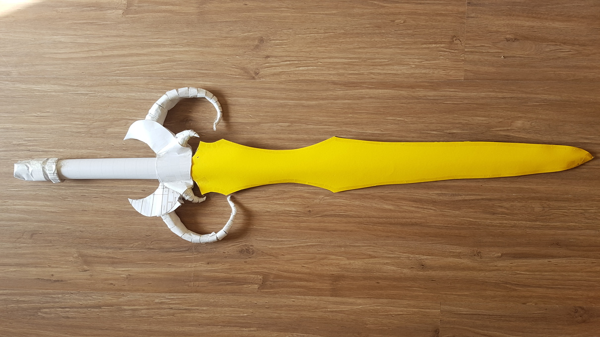

Die Rollen ragen noch weiter nach hinten raus und bilden dadurch den Griff, welchen ich mit weiteren Papierrollen verziert habe

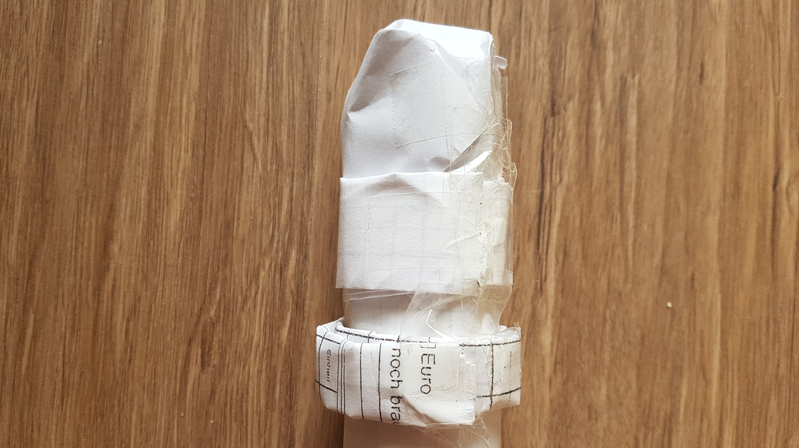

Auch die "Hörner" zwischen Klinge und Griff bestehen aus Papierrollen und Pappe

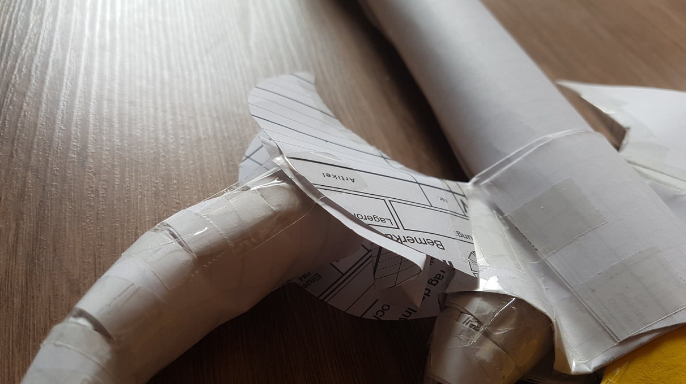

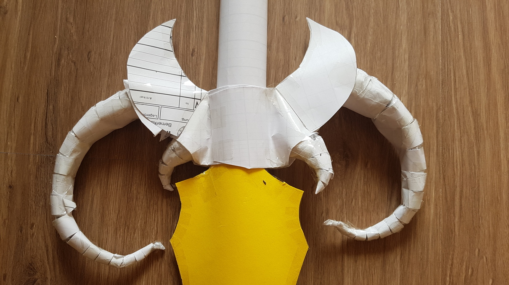

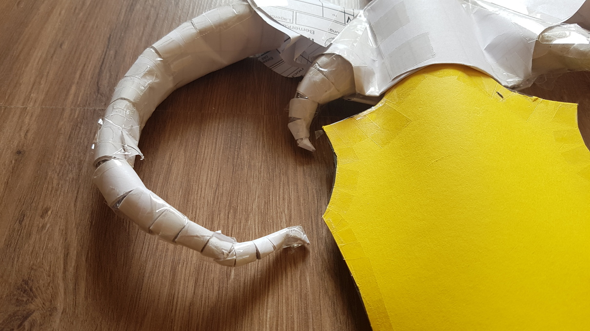

Anschließend wurde alles mit Zeitungspapier und selbstgemachtem Kleister aus Mehl und Wasser (oder war es Stärke und Wasser?!?) eingedeckt, was übrigens hervorragend funktioniert und eine sehr stabile Form bildet

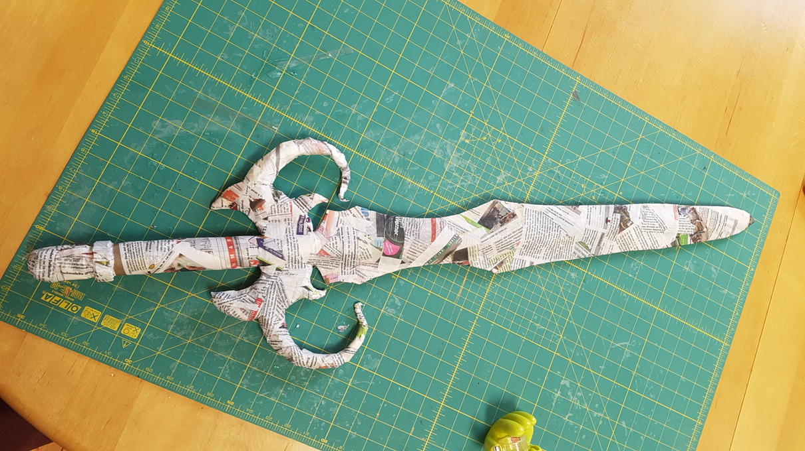

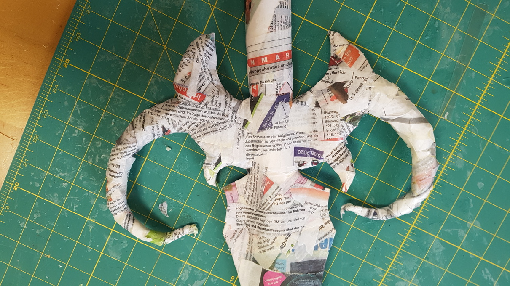

Zu guter Letzt natürlich noch die Farbe

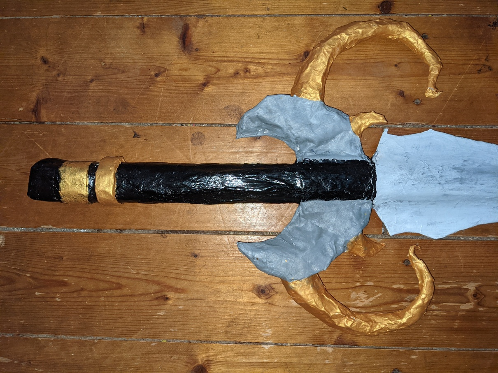

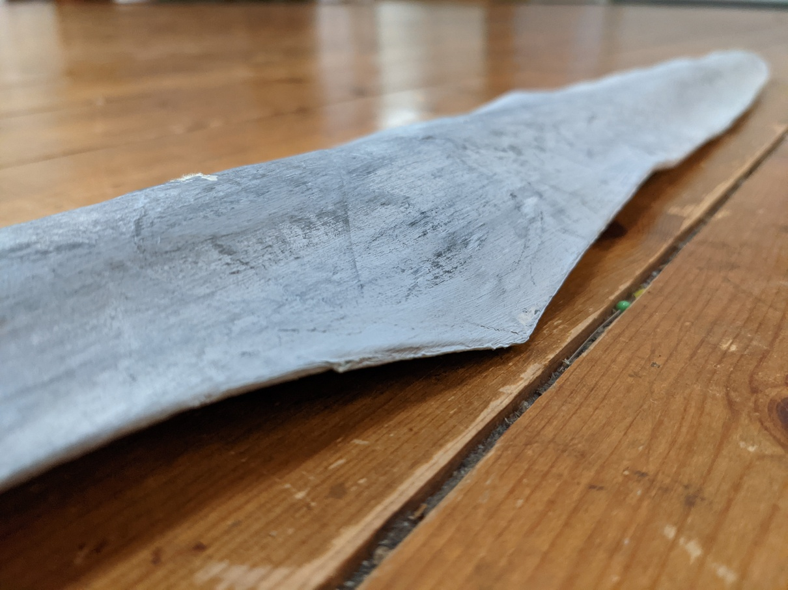

Das fertige Schwert ist etwa 1,50m lang und hat am Dinner auf jeden Fall was hergemacht 

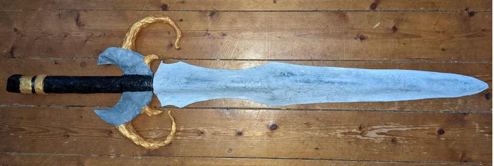

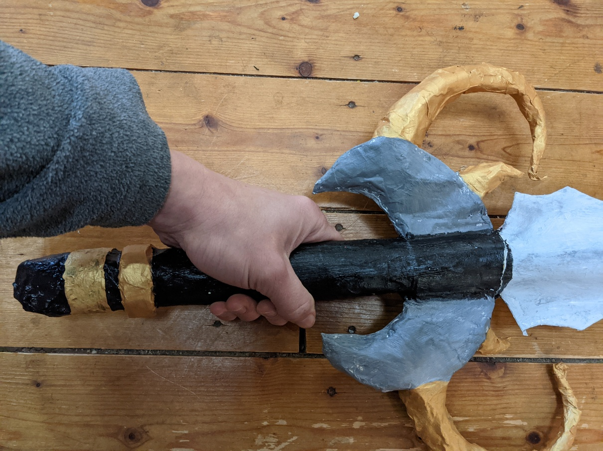

Der Hexenmeister, welcher von meinem Mann verkörpert wurde, benötigte dann natürlich auch noch einen Zauberstab, den ich in ganz ähnlicher Weise hergestellt habe. Dazu gibt es leider keine Bilder in der Entstehung.

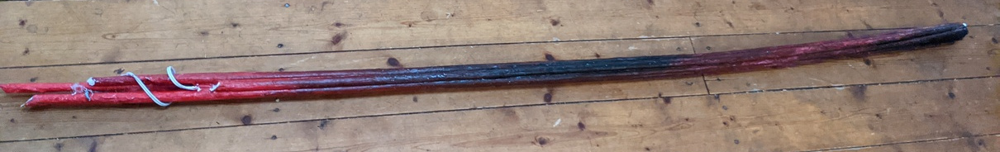

Besonder ist hierbei vor allen die Funktion des glühenden Stabs, wenn man ihn auf den Boden aufstellt. Das habe ich ganz einfach durch Kabel, Batterien und eine LED realisiert, welche im Inneren des Stabs verstaut sind.

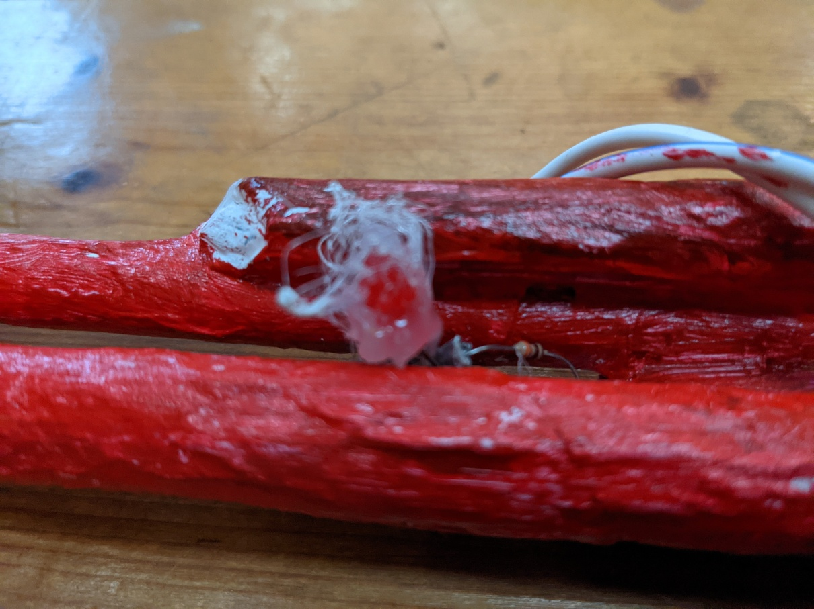

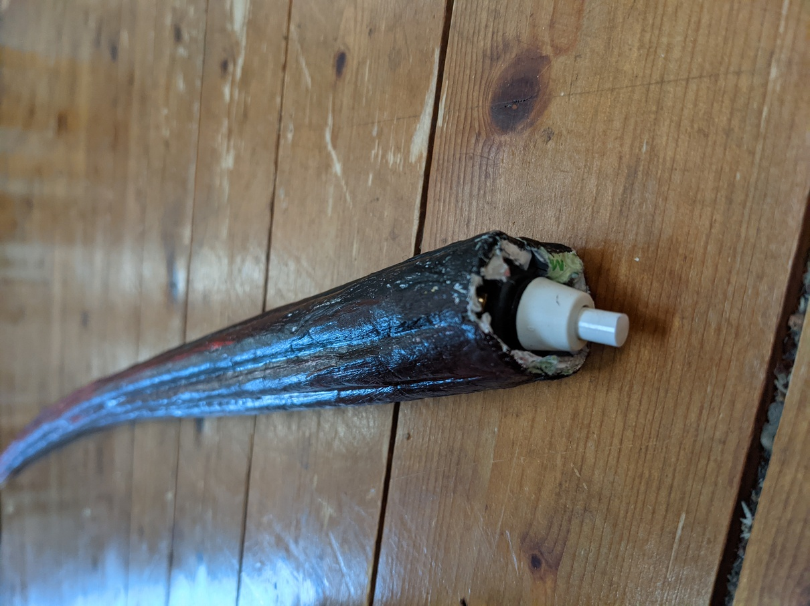

Ursprünglich hatte ich mir ein paar mehr Lichter mit schönerer Verzierung durch die Heißklebepilstole gewünscht, aber irgendwie wurde das zeitlich doch mal wieder alles zu knapp und der Tag des Krimidinners stand vor der Tür. Also wurde der Stab eher halbfertig mit Kabelumwicklung überreicht.

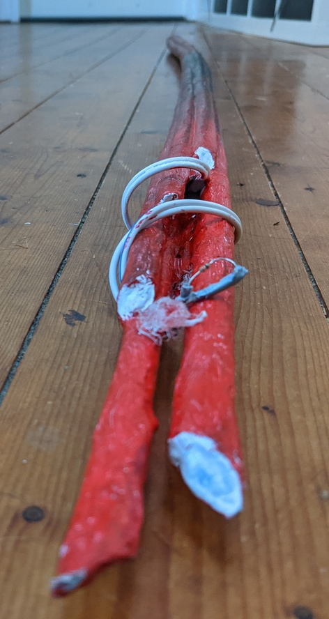

Auch die Spitzen hätten noch vergoldet werden sollen, aber naja...
