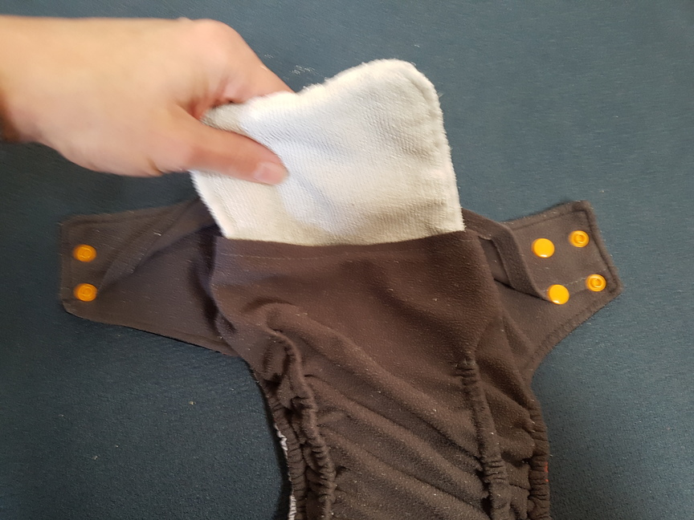
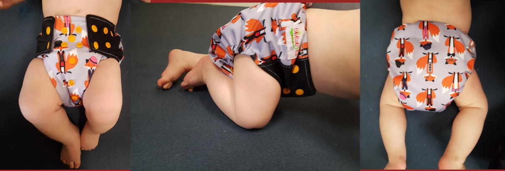
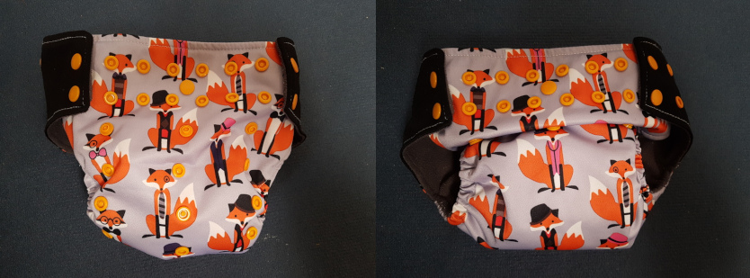

"Die da, die da, die da, die da, die da oder die da?" 

Wer sich mal mit dem Thema Stoffwindeln beschäftigt, wird erstmal leicht überfordert. Ich hatte mich auch informiert, bin zur Windelberatung, habe mich für ein System entschieden und habe dann versehentlich ein anderes gekauft... Aber ich bin genügsam und nutze, was mir zur Verfügung steht. Als dann nach 6 Monaten die Windeln fast täglich 3 Mal ausliefen, musste was Neues her! Ebay Kleianzeigen war nicht mehr vor mir sicher und ich  bestellte gleich mehrere verschiedene Höschen. Hier mein persönlicher Testbericht! Anwendungsfehler sind nicht ausgeschlossen ;)

1. Pocketwindeln von OhBabyKa

2. PUL-Windeln von (geknöpft)

3. PUL-Windeln von (mit Klett)
   
   - Vergleich Pocketwindeln vs. Taschenlos
   
   - Vergleich Knöpfe vs. Klett

4- Höschenwindeln von Totsbots

5- Bindewindeln von Disana

6- Bindewindeln von Disana aber ohne Binden

7- Windelmanufaktur

8- Selbst genäht nach dem Fluff Stuff V2 Schnittmuster

Der aufmerksame vorgebildete Leser merkt, dass es sich die Systeme ähneln und keine "All in one-Systeme" (AIO) getestet wurden. Da hatte ich einfach von  vornerein keine Lust drauf.

#### 1. Pocketwindeln von OhBayKa

###### Aufbau

Pocketwindeln haben - man mag es kaum glauben - eine Tasche! In diese Tasche werden die Saugeinlagen gelegt, welche beim Windelwechsel zum Waschen wieder herausgenommen werden müssen.

Die Tasche ist aus weichem, dunklem Stoff (Fleece??), welcher die Feuchtigkeit schnell an die Saugeinlage weiterleitet und angenehm auf der Haut ist. Der Außenstoff ist aus PUL und sorgt dafür, dass die Feuchtigkeit der Saugeinlage nicht nach außen dringt. Dabei ist sie dennoch ein wenig atmungsaktiv.

Der Verschluss funktioniert über Druckknöpfe. Außerdem kann die Windel Dank weiterer Druckknöpfe in der Größe variiert werden, sodass die Windel "über die gesamte Windelzeit" nutzbar ist. Wir haben also tatsächlich nur diese eine Größe.

###### Meine Erfahrung

Anfangs kamen wir ganz gut mit dem System klar. Die Windeln halten dicht und man kann zusätzliche Materialien einlegen, damit die Windel mehr saugt. Allerdings hatten wir immer wieder Unfälle und die Nacht über hält sie auf keinen Fall. Je Älter das Kind wurde, desto mehr Unfälle gab es, bis die Windel fast täglich (teilweise mehrmals) ausgelaufen ist.

Auch die verstellbare Größe, die ja eigentlich ein Vorteil ist, hat mich eher überfordert. Ich wusste nie genau, wie groß denn jetzt gut ist und wie die Windel eigentlich sitzen soll. Eventuell hat das auch zum vermehrten Auslaufen gesorgt, allerdings habe ich es nicht in den Griff bekommen, egal welche Größe ich eingestellt habe.
