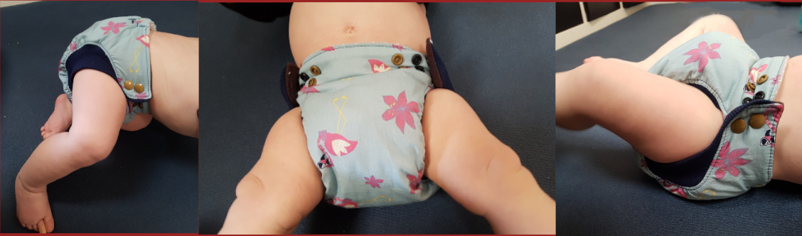

**Vorsicht**: Mammutbeitrag! Gerne könnt ihr einfach zur Zusammenfassung am Ende vorrücken

---

"Die da, die da, die da, die da, die da oder die da?" 

Wer sich mal mit dem Thema Stoffwindeln beschäftigt, wird erstmal leicht überfordert. Ich hatte mich auch informiert, bin zur Windelberatung, habe mich für ein System entschieden und habe dann versehentlich ein anderes gekauft... Aber ich bin genügsam und nutze, was mir zur Verfügung steht. Als dann nach 6 Monaten die Windeln fast täglich 3 Mal ausliefen, musste was Neues her! Ebay Kleianzeigen war nicht mehr vor mir sicher und ich  bestellte gleich mehrere verschiedene Höschen. Hier mein persönlicher Testbericht! Anwendungsfehler sind nicht ausgeschlossen ;)

1. Pocketwindeln von OhBabyKa

2. PUL-Windeln von (geknöpft) und von (mit Klett)

3. Höschenwindeln von Totsbots

4. Bindewindeln von Disana

5. Bindewindeln von Disana aber ohne Binden

6. Windelmanufaktur

7. Selbst genäht nach dem Fluff Stuff V2 Schnittmuster

Der aufmerksame vorgebildete Leser merkt, dass es sich die Systeme ähneln und keine "All in one-Systeme" (AIO) getestet wurden. Da hatte ich einfach von  vornerein keine Lust drauf.

#### 1. Pocketwindeln von OhBayKa

###### Aufbau und Funktion

Pocketwindeln haben - man mag es kaum glauben - eine Tasche! In diese Tasche werden die Saugeinlagen gelegt, welche beim Windelwechsel zum Waschen wieder herausgenommen werden müssen. Die Außenwindel muss dabei jedesmal gewaschen werden, da sich ja mit dem Teil, der direkt am Kinderpo ist, vernäht ist.

Die Tasche ist aus weichem, dunklem Stoff (Fleece??), welcher die Feuchtigkeit schnell an die Saugeinlage weiterleitet und angenehm auf der Haut ist. Der Außenstoff ist aus PUL und sorgt dafür, dass die Feuchtigkeit der Saugeinlage nicht nach außen dringt. Dabei ist sie dennoch ein wenig atmungsaktiv.

Der Verschluss funktioniert über Druckknöpfe. Außerdem kann die Windel Dank weiterer Druckknöpfe in der Größe variiert werden, sodass die Windel "über die gesamte Windelzeit" nutzbar ist. Wir haben also tatsächlich nur diese eine Größe.

###### Meine Erfahrung

Anfangs kamen wir ganz gut mit dem System klar. Die Windeln halten dicht und man kann zusätzliche Materialien einlegen, damit die Windel mehr saugt. Allerdings hatten wir immer wieder Unfälle und die Nacht über hält sie auf keinen Fall. Je Älter das Kind wurde, desto mehr Unfälle gab es, bis die Windel fast täglich (teilweise mehrmals) ausgelaufen ist.

Auch die verstellbare Größe, die ja eigentlich ein Vorteil ist, hat mich eher überfordert. Ich wusste nie genau, wie groß denn jetzt gut ist und wie die Windel eigentlich sitzen soll. Eventuell hat das auch zum vermehrten Auslaufen gesorgt, allerdings habe ich es nicht in den Griff bekommen, egal welche Größe ich eingestellt habe.

Außerdem halte ich Pocketwindeln für unnötig. Wenn man sowieso die ganze Windel waschen muss, kann man auch gleich AIO nutzen... die sind weniger aufwendig und brauchen lediglich etwas länger zum Trocknen.

#### 2. PUL-Windeln von (geknöpft) und von (mit Klett)

###### Aufbau und Funktion

Die Windeln funktionieren fast genauso wie die Pocketwindeln mit dem Unterschied, dass die Einlagen nicht in eine Tasche eingeschoben, sondern direkt aufgelegt werden können.

-Bild Einlage auf Außenwindel-

Zum Waschen muss die volle Windel dann nicht mehr angefasst werden.

Auch hier kann die Größe wieder durch Knöpfe verstellt werden. Ein Doppelbündchen, soll auslaufen verhindern.

-Bild Windel groß klein-

Die Windeln von xxx lassen sich mit Klett verschließen. Damit beim Waschen nicht alles wild aneinander klebt, befindet sich auf der Rückseite ein Gegenklett, welcher geschlossen werden sollte, bevor die Windel in die Wäsche kommt. So bleibt der Klett länger haltbar.

###### Meine Erfahrung

Die Frage "Klett oder Knopf?" kann ich nun eindeutig mit "Knopf!" beantworten. Zwar ist es deutlich angenehmer und schneller mit Klett zu schließen, allerdings lösen sich diese blöden Dinger eigenltich immer vom Gegenklett oder man vergisst von vornerein, diesen zu benutzen, sodass in der Wäsche immer alles aneinander und am Wäschenetz hängt. Vielleicht bin ich auch zu blöd das ganze zu Benutzen, aber mir ging es auf die Nerven. Außerdem verlieren einige Kletts bereits an Haltekraft, was im Sinne der Nachhaltigkeit natürlich wenig nachhaltig ist. Die Klettfrage hat sich uns aber ohnehin schon sehr bald nicht mehr gestellt, weil die Außenwindeln dieser Marke die 60°C-Wäsche nicht vertragen haben und schon nach wenigen Wochen undicht wurden.

Die Knöpfvariante hat uns gemeinsam mit den Pocketwindeln begleitet und ich habe sie lieber genutzt als diese, da sie ohne das nerviges Rein- und Rausfummeln der Einlage funktionierten (gut... soooo aufwendig ist es nun auch wieder nicht. Geht eigenltich schnell, aber wenn man es sich sparen kann...).

Leider ging die Kacka immer und manchmal auch das Pipi auf die Außenwindel, sodass auch hier eigenltich immer alles in die Wäsche musste. 

Im Punkt Auslaufsicherheit habe ich ebenfalls keinen Unterschied zur Pocketwindel feststellen können, wodurch es bei mir zu einem "Tschüss, auf nimmer wiedersehen" endet.

Allerdings muss man herausstellen, dass es sich bei allen bisher vorgestellten Marken um sehr billig produzierte Produkte handelt. Das war mir beim Kauf nicht klar. Über teurere (höherwertigere??) Außenwindeln desselben Systems kann ich also keine Aussage treffen.

#### 3. Höschenwindel von Totsbots

###### Aufbau und Funktion

Bei den Höschenwindeln von Totsbots handelt es sich um Bambuswindeln mit Klett. Auch sie können wieder kleiner geknöpft werden. Die Höschen müssen noch durch eine wasserdichte Außenwindel aus PUL oder Wolle ergänzt werden. 

###### Meine Erfahrungen

Wir hatten sie als Nachtwindel in Verbindung mit den oben vorgestellten PUL-Überhöschen an. Am Anfang ging das auch ganz gut, bis der kleine größer wurde und mehr pinkelte. Dann sind wir auf Wegwerfwindeln in der Nacht umgestiegen. 

Die Höschen sind recht  steif und machen einen riesigen Windelpo. Deswegen haben wir sie nicht tagsüber nicht tragen wollen.

#### 4. Bindewindeln von Disana

###### Aufbau und  Funktion

Die Bindewindeln werden zunächst um den Windelbereich herum gelegt und schließlich mit dem angenähten Bändchen um den Körper festgebunden. 

Anschließend muss wieder eine wasserdichte Außenwindel drüber. Die von Disana sind leider keine Schönheit und noch dazu für unseren Knopf noch 2 Nummern zu groß.

-Bild Disana mit Überhose-

Die Windeln lassen sich durch beliebig viele Einlagen boosten.

###### Meine Erfahrungen

Nicht schön aber funktioniert! Bisher nichts ausgelaufen! Sogar nachts können wir sie problemlos mit einem zusätzlichen Ikea-Lappen 10 bis 12 Stunden tragen ohne dass ein Tröpfchen auf die Klamotten geht. Die Außenwindel wird tatsächlich nur in den seltensten Fällen dreckig, sodass wir diese meist nur mit Wasser abspülen und die Wäsche fast ausschließlich mit dem kochbaren Saugmaterial voll ist. 

Außerdem ist der gestrickte Stoff sehr anschmiegsam und bliebt auch nach mehreren Wäschen weich.

Einen Nachteil hat das ganze schon: Die Windeln benötigen deutlich mehr Platz auf der Wäscheleine als die zuvor vorgestellten Systeme. Außerdem ist das Anlegen bei einem mobilen Baby schon eine Herausforderung. Die Bändchen bilden außerdem einen wunderschönen Knoten mit allem anderen in der Wäsche, sodass eine deutlich sinnvollere Variante die...

#### 5. Bindewindeln von Disana aber ohne Binden

sind...

Einfach Bändel ab, Snappi  dran, fertig ist die (fast) perfekte Windel! Das Wäscheproblem bleibt natürlich aber ansonsten ein super System. Und unschlagbar günstig noch dazu!

- Bild Disana mit Snappi

#### 6. Windelmanufaktur

Ich wollte es wissen, ob diese teuren Windeln einfach nur teuer oder auch wirklich besser sind. Also schnell mal zwei Höschen auf dem Gebrauchtmarkt erworben und getestet.

###### Aufbau und Funktion

Die Windelmanufaktur arbeitet mit dem "All-in-3-System" (AI3). Das heißt: eine hübsche Außenwindel aus Baumwollstoff o.ä., eine wasserdichte Innenwindel zum Einknöpfen und schließlich eine Saugeinlage.

Sieht einfach süß aus. Das muss man schon sagen!

###### Meine Erfahrungen

Suuuper süß aber dadurch, dass man ständig diese Innenwindeln ein- und ausknöpfen muss, dauert die Vorbereitung relativ lang. Der Vorteil ist aber, dass sie dann recht flott angelegt sind, weswegen wir diese Windeln nutzen, wenn wir unterwegs sind. 

Dicht halten sie schon, allerdings nicht so gut wie die Disana Strickwindeln. Da muss schon regelmäßig gewechselt werden, sonst gibt es feuchte Klamotten.

#### 7. Selbst genäht nach dem Fluff Stuff V2 Schnittmuster

Es musste einfach sein... nachdem ich die Windelmanufaktur-Kunstwerke in der Hand und am Windelpo gesehen habe, hat es mir in den Fingern gejuckt, selbst Hand anzulegen. Genaueres zur Produktion gib es in einem anderen Blogbeitrag von mir zu lesen. Nur soviel schonmal: Kein Nachteil zur Windelmanufaktur bisher. Allerdings ist das Einknöpfen der Innenwindel durch die Laschen etwas aufwändiger.

---

### Zusammenfassung

Wer billig kauft, kauft zweimal. Es sei denn, man kauft die Strickwindeln von Disana (am besten noch gebraucht) und schneidet die Bändel ab. Dann kauft man günstig und freut sich :)

Windelmanufaktur ist schön und gut, wer selbst nähen kann, wird mit dem Fluff Stuff V2 Schnittmuster seine Freude haben und Geld sparen.

Knöpfe sind beim Waschen und in der Langlebigkeit dem Klettverschluss überlegen. Deswegen gibt es die auch viel häufiger (Ich habe anfangs eeewig gesucht um Klett zu finden... gut... vielleicht war ich auch nur schlecht im Suchen...).
