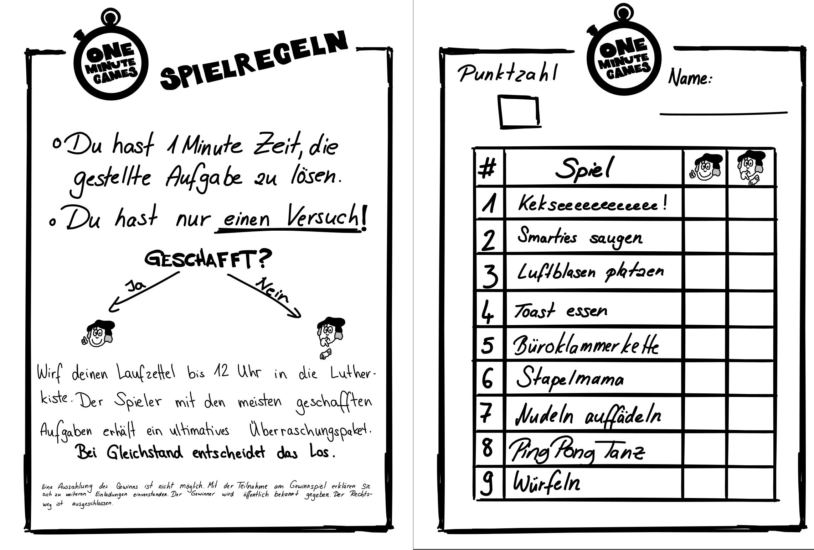
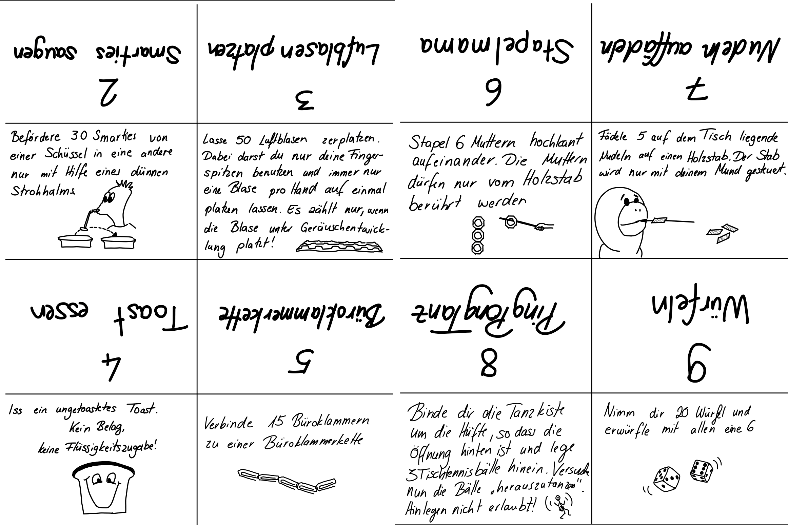

Alle Dokumente könen ganz unten als PDF herunter geladen werden

---

Partytime!!! Aber feiern und dabei nur rumsitzen, quatschen und trinken ist nicht so nach meinem Geschmack. Ein bisschen Action muss schon sein! Daher habe ich meinen Gästen 9 kleine Aufgaben gestellt, die in nur einer Minute bewältigt werden mussten. Jeder hat nur genau einen Versuch pro Aufgabe. Der Gewinner hat ein kleines Spaßgeschenk erhalten.

Die Laufzettel habe ich doppelseitig auf A6 ausgedruckt verteilt. So konnten die Aufgaben während der Feier nebenbei zu jeder Zeit erledigt werden. Zur Eröffnung habe ich das erste Spiel "Kekseeeee" mit allen gemeinsam gespielt. So wurde die Idee deutlich und alle wussten über die Existenz die Funktion der Spiele deutlich. Außerdem ist das Spiel einfach super lustig in großen Gruppen ;)

2017 war das Lutherjahr und ich habe auch noch am Reformationstag Geburtstag, daher musste der liebe Luther als Mascottchen herhalten.

#### Nun zu den Spielen:

Die Erklärkärtchen habe ich zu den jeweiligen Materialien gelegt und aufgestellt.

Da ich das Spiel "Kekseeeee!" mit allen gemeinsam gespielt habe, gibt es natürlich kein Erklärkärtchen dazu. Die Aufgabe:

> Lege dir einen Cookie auf die Stirn. Versuche nun ohne Hände, nur unter Benutzung deiner Gesichtsmuskulatur und der Schwerkraft, den Keks in deinen Mund zu befördern. Fällt der Keks herunter, musst du wieder auf der Stirn beginnen. Die Zeit läuft derweil natürlich weiter!

Bei dem Spiel "Luftblasen Platzen" geht es um das Platzenlassen von Luftpolsterfolie.

#### Kritik

Insgesamt waren die Spiele für Erwachsene eher etwas zu einfach. Es gab 3 Leute, die alles geschafft haben und sehr viele mit 7 oder 8 Punkten. Ich wollte die Spiele eben nicht zu intensiv testen, weil ich sie selbst ja sonst schon geübt hätte.... Für Kinder sind die Anforderungen vermutlich ok, für Erwachsene würde ich sie deutlich hochsetzen.

Spaß gemacht hat es aber allemal!

#### Download

[PDF OneMinuteGames](Dateien/OneMinuteGames.pdf)

