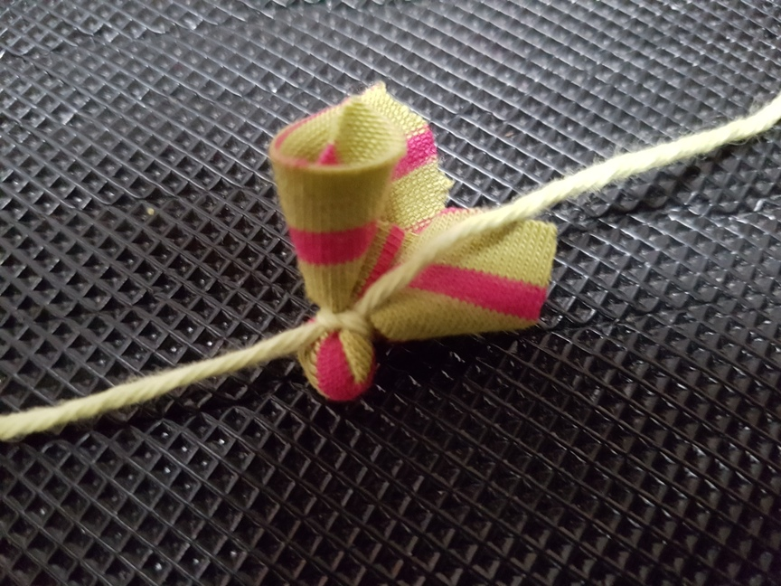

Weihnachtsfeier in großer Runde! Meine gesamte Familie mütterlicherseits kommt am 4. Advent zusammen, um Weihnachten zu feiern. In den vergangenen Jahren gab es mehr und mehr Familienzuwachs, sodass dieses Jahr 9 Kinder zwischen 0 und 9 Jahren herum toben werden. Um die Meute zu beschäftigen, habe ich mir ein Spiel überlegt, welches (hoffentlich) allen Kindern trotz des unterschiedlichen Alters Freude bereitet.

### Die Geschichte

Der oberste Weihnachtself möchte den hohen Rat der Elfen einberufen, kann die anderen Elfen aber nicht finden! Die Kinder sollen die Pappelfen im ganzen Haus (oder Zimmer) suchen. Anschließend bittet der Elf noch darum, dass die Kinder Zutaten für Weihnachtsplätzchen herbeischaffen.

Die Geschichte wird über Audiodateien erzählt, welche über eine Phonie-Box (selbstgebaute Toniebox, welche wir gebaut haben) abgespielt werden, wenn die Kinder die jeweilige Figur über die Box halten. Alternativ kann man die Audiodateien auch einfach mit dem Handy abspielen.

Die Audiodateien habe ich selbst eingesprochen und habe die Stimme anschließend mit der App "Voice Editor" verzerrt. Die Audiodateien findet ihr ganz unten im Post zum Download.

### Teil 1: Weihnachtselfen finden

##### Vorbereitung:

Die Weihnachtselfen und das Sammelblatt müssen auf A4 oder noch besser auf A3 ausgedruckt werden (Download ganz unten hier im Post). Die Elfen mit Pappe verstärken, ausschneiden und im ganzen Haus verstecken. Ich habe Schränke und Schubladen von vornherein ausgeschlossen, um das Chaos nicht zu groß werden zu lassen.

Die Zutaten oben links im Bild werden später erst gebraucht. Auch diese habe ich mit Pappe verstärkt, etwas rundlich ausgeschnitten und anschließend einen RFID-Chip auf die Rückseite geklebt, welcher auf die dazu passende Audiodatei eingestellt ist. 


##### Vorgehen:

Die Kinder werden zusammengeholt, der oberste Weihnachtself (mit roter Mütze) wird in die Mitte gelegt und die erste Audiodatei "Wichtel_Einführung" abgespielt. Die Kinder suchen anschließend das Haus nach Elfen ab.

Wenn alle Elfen gefunden wurden, wird die zweite Audiodatei "Wichtel_Zutaten beschaffen" abgespielt, in welchem sie aufgefordert werden, verschiedene Zutaten zu beschaffen. Ich habe mich auf 4 Zutaten beschränkt, damit das Spiel nicht zu lange läuft.

### Teil 2: Mehl schöpfen

"Wir brauchen eine Tasse Mehl. Das Mehl könnt ihr mit Löffeln vom Mehlberg schöpfen. Allerdings hält Lieselotte dort ihren Winterschlaf. Ihr müsst also sehr vorsichtig sein und nicht zu viel Mehl abschöpfen, sodass Lieselotte herunter fällt." (Audiodatei: "Wichtel_Mehl")

##### Vorbereitung:

Aus Mehl wird auf einem Teller ein kleiner Mehlberg geformt. Oben drauf wird eine klein Figur (oder ein Gummibärchen) gestellt. Ein Esslöffel wird daneben gelegt.

##### Vorgehen:

Die Kinder spielen quasi Mehlschneiden. Sie versuchen also mit dem Löffel Mehl vom  Berg abzuschöpfen ohne, dass der Berg in sich zusammenfällt. Abgeschöpftes Mehl wird in einer Tasse gesammelt.

### Teil 3: Zucker sammeln

"Wir brauchen einen Becher voll Zucker. Zucker bekommt ihr vom süßen Strand der Zwergeninsel. Der Weg zum Strand ist gefährlich und ihr dürft den Zucker nur mit Löffeln transportieren. sonst wird er ungenießbar! Wenn dabei etwas Zucker verschüttet, ist's nicht weiter schlimm. Holt einfach neuen vom Strand."

##### Vorbereitung

Ich habe aus Zucker, einem alten Karton, einem blauen Stoffrest und den guten alten Ü-Ei-Figuren den Zwergenstrand gebastelt. Der Zucker bildet dabei den Sand, der mit Löffeln abgeschöpft werden soll. Im Raum habe ich dann einige Möbel und Gegenstände verteilt, über welche die Kinder drüber steigen müssen.

##### Vorgehen

Die Kinder haben jeweils einen Teelöffel und müssen diesen immer wieder am Zwergenstrand auffüllen und zum gemeinsamen Becher bringen. Unterwegs müssen sie über die Gegenstände laufen und dabei möglichst wenig Zucker verlieren. Alle Kinder können gleichzeitig laufen, bis der Becher gefüllt ist. 

Ein bisschen Sauerei ist das schon, aber ich habe es in einem leicht zu saugenden Raum gemacht. Dadurch ist es nicht allzuviel Dreck.


### Teil 4: Nüsse angeln

"Wir brauchen eine Tüte voll Nüsse. Nüsse könnt ihr mit diesen Angeln aus dem Nussloch angeln."

##### Vorbereitung

Ich habe einige Walnüsse mit Draht umschlungen, sodass sie an den sehr einfach gebastelten Magnetangeln haften bleiben. Die Angeln bestehen lediglich aus einem Neodymmagnet, welcher in einen Stoffrest gewickelt an einem Stück Wolle hängt. Um es etwas schwieriger zu gestalten, kann man die Wolle noch an einen Stab binden, sodass eine richtige Angel entsteht. 

##### Vorgehen

Die Kinder sitzen auf dem Sofa und müssen mit ihren magnetischen Aneln die Nüsse vom Boden aufsammeln.

```html

```





### Teil 5: Ausstechförmchen abholen

"Die besten Ausstechförmchen hat der Weihnachtsmann am Nordpol! Springt von Eisscholle zu Eisscholle, ohne dabei in das eiskalte Wasser zu fallen. Jedes Kind kann dabei immer nur ein Förmchen tragen!"

##### Vorbereitung

Kissen oder andere Bodenmarkierungen werden i nerreichbarer Sprungentfernung auf dem Boden verteilt.

##### Vorgehen

Die Kinder springen von Kissen zu Kissen, bis sie "den Nordpol" (einen markierten Bereich) erreicht haben. Dort erhalten sie ein Förmchen, mit welchem sie wieder zurück springen müssen. Wenn sie "ins Wasser fallen" (den Boden berühren), müssen sie wieder von vorne anfangen und gegebenenfalls ihr Förmchen zurücklegen.

### Teil 6: Das Ende

"Ich danke euch liebe Kinder! Ich möchte euch dieses kleine Geschenk als Zeichen meiner Dankbarkeit schenken.  Nun kann Weihnachten kommen!"

Ich habe den Kindern lediglich ein paar kleine Schokoladenbonbons zusammengepackt, sodass jedes Kind eines bekommt. Ich habe auch noch darüber nachgedacht, Zauberstifte zu verschenken (Stifte, die nur mit UV-Lampe sichtbar werden), bin dann aber bei der weniger materiellen Variante geblieben.

## Varianten

Folgende Ideen hatte ich, um das Spiel anders aufzubauen oder zu erweitern. Wenn du noch mehr Ideen hast, würde ich mich über einen Kommentar freuen, dann kann die Liste noch erweitert werden.

- Statt der Audio-Dateien kann es einen Spielleiter im Elfenkostüm geben

- Zutaten mit einem Schlitten transportieren: Ein Wäschekorb oder ein richtiger Schlitten wird unten mit Filz beklebt, sodass er auf dem Boden rutscht. Die Kinder müssen ihn dann über den Boden ziehen, um ein bestimmtes Ziel zu erreichen.

## Viel Spaß beim Spielen!

---

### Download

[Audiodateien](Dateien/Audiodateien.zip)

[Elfen mit Sammelblatt und Zutaten](Dateien/Weihnachtselfenspiel.pdf)
